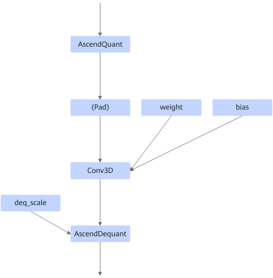
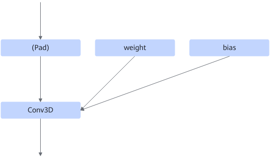

# Conv3DQuantProcessFusionPass

## 融合模式

静态shape场景下，当匹配到如下图结构时，可以进行量化回退或者bias优化。

- bias优化：当AscendQuant的c0值大于fp16的c0值或Conv3D不支持fp16格式的时候，进行bias优化，否则进行量化回退。bias优化不涉及图结构修改。
- 量化回退：则会插入常量折叠算子，用来把AscendQuant和AscendDequant算子消除。具体请参见下图。

量化回退场景下融合成

## 使用约束

无
