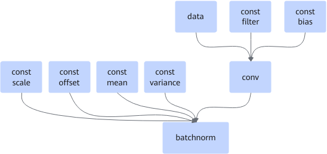

# ConvBatchnormFusionPass

## 融合模式

该融合将Conv2d+batchnorm或者Conv3d+batchnorm融合为一个融合算子；当batchnorm为2个输入时，在这种情况下，会将DepthwiseConv2d+batchnorm融合为一个融合算子。

融合为

## 使用约束

- conv节点可以是Conv2D，也可以是Conv3D。当batchnorm节点只有2个输入（mean，variance）时，conv节点也可以是DepthwiseConv2D。
- batchnorm节点可以是batchnorm，也可以是BNInference。
- filter、bias必须是const，否则不融合；如果filter是QuantWeightRollBack，不融合。
- batchnorm节点的输入，可以是2个输入（mean，variance），也可以是上述4个输入，所有输入必须是const，否则不融合。
- data输入为动态时，支持融合。
- 卷积节点weight输入为动态时，不融合。

## 支持的型号

<!-- npu="310p" id1 -->
Atlas 推理系列产品
<!-- end id1 -->

<!-- npu="310b" id2 -->
Atlas 200I/500 A2 推理产品
<!-- end id2 -->

<!-- npu="910" id3 -->
Atlas 训练系列产品
<!-- end id3 -->
