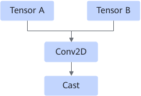
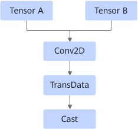
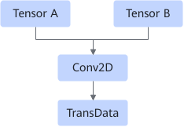

# ConvCastFusionPass

## 融合模式

将Conv2D算子与Cast算子融合为一个Conv2D算子。

融合成

或者

融合成

## 使用约束

- 当Conv2D的输入数据类型为float16，Cast输出数据类型为float32时，该融合生效。
- 当Conv2D或Cast节点为动态时，不融合。
- 当Conv2D输入节点中有StridedRead时，不融合。
- 当Conv2D输出节点大于1个时，不融合。

## 支持的型号

<!-- npu="310p" id1 -->
Atlas 推理系列产品
<!-- end id1 -->

<!-- npu="310b" id2 -->
Atlas 200I/500 A2 推理产品
<!-- end id2 -->

<!-- npu="910" id3 -->
Atlas 训练系列产品
<!-- end id3 -->
