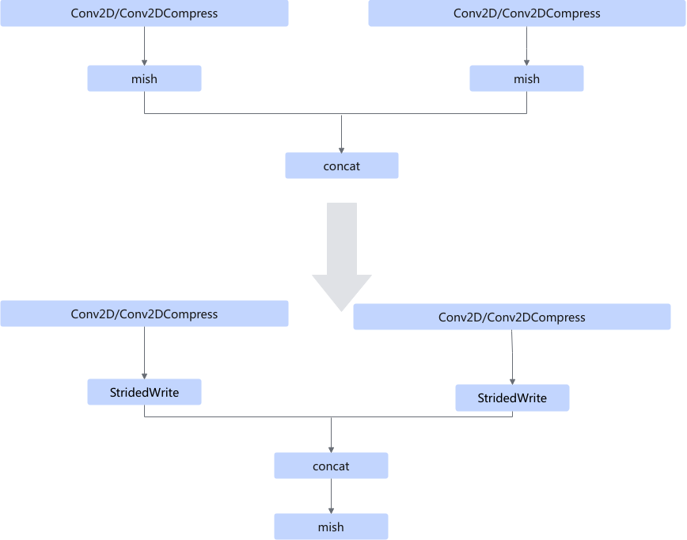
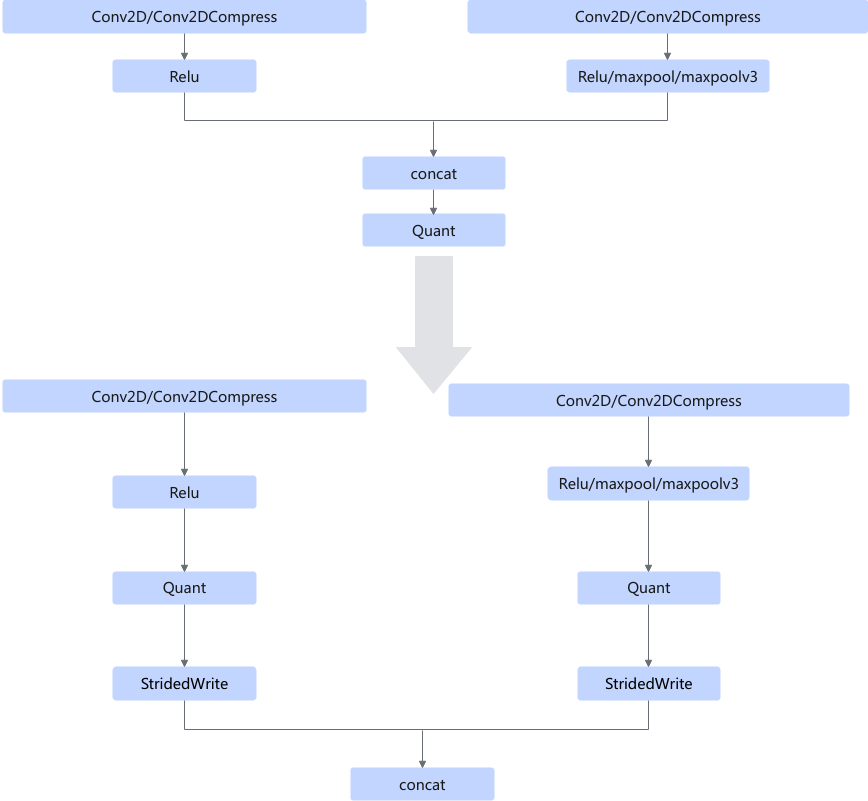
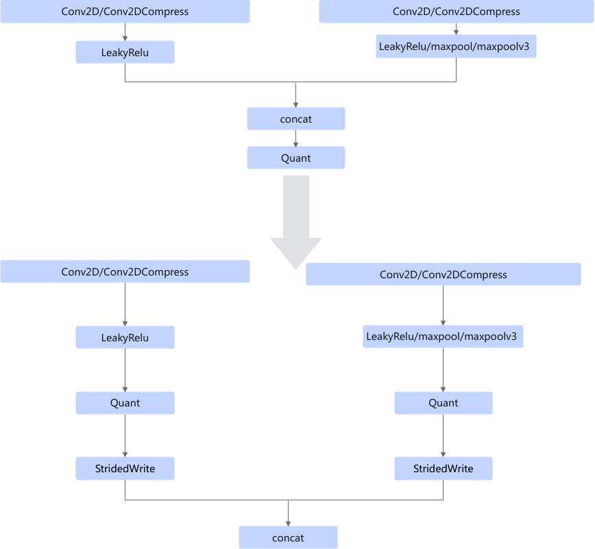
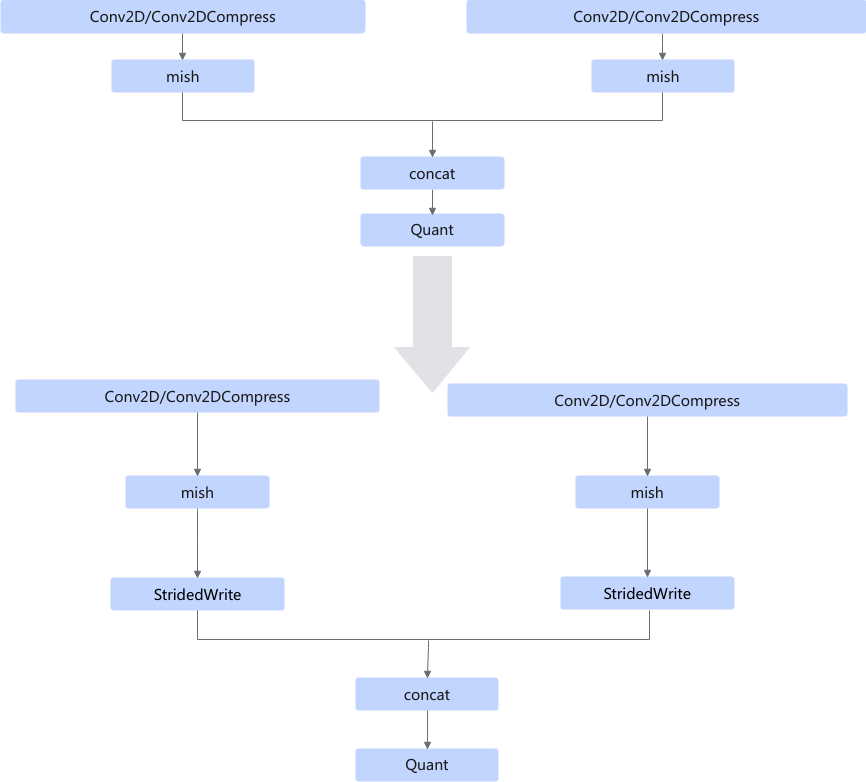
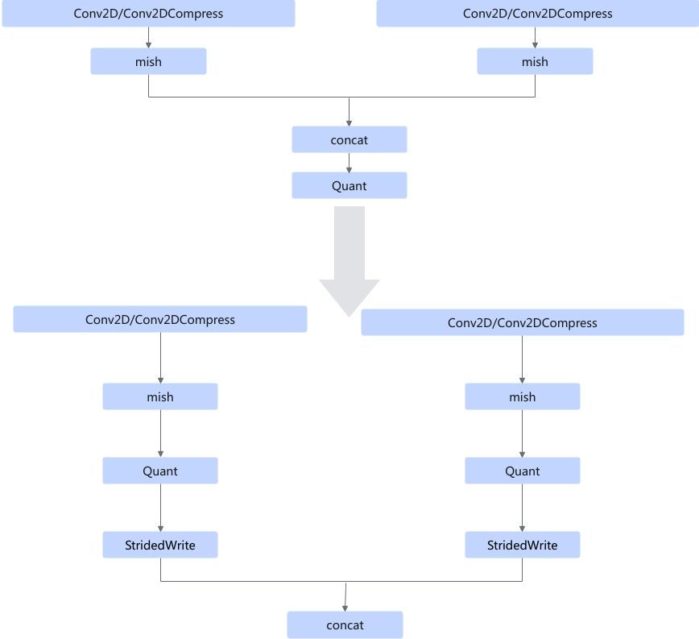
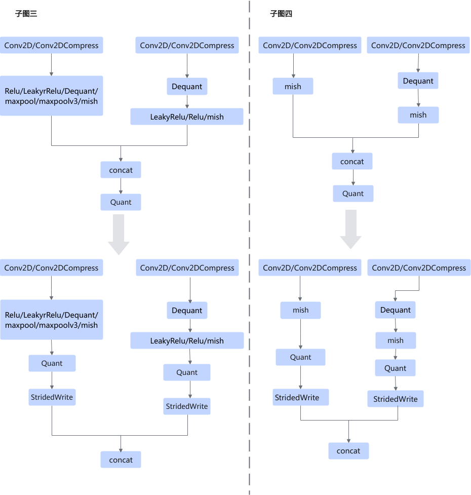

# ConvConcatFusionPass

## 融合模式

在concat算子前插入跳写算子，将原先通过concat拼接多个Conv2D内存的方式，修改成通过StridedWrite算子进行Conv2D内存拼接，以消除concat算子任务执行带来的性能消耗。

concat算子包括ConcatD/ConcatV2D，Conv2D算子包括Conv2D/Conv2D\_Compress。

<!-- npu="A3,910b,310b" id1 -->
如下型号不支持StridedWrite，但会通过硬件实现StridedWrite类似功能，所以ConvConcatFusionPass也会匹配上。 
<!-- npu="910b" id2 -->
- Atlas A2 训练系列产品/Atlas A2 推理系列产品 
<!-- end id2 -->
<!-- npu="A3" id3 -->
- Atlas A3 训练系列产品/Atlas A3 推理系列产品 
<!-- end id3 -->
<!-- npu="310b" id4 -->
- Atlas 200I/500 A2 推理产品
<!-- end id4 -->
<!-- end id1 -->

**子图中不存在Dequant和Quant时，有如下场景**

场景一：

场景二：

场景三：

场景四：

场景五：

场景六：AIcore中cube和vector不分离时，不需要做mish融合。

场景七：AIcore中cube和vector分离时，需要做mish融合。

**子图中不存在Dequant，但存在Quant时，有如下场景**

场景一：

场景二：

场景三：

场景四：

场景五：

场景六：AIcore中cube和vector不分离时，还有如下场景。

**子图中存在Dequant且不存在Quant时，有如下场景**

场景一：AIcore中cube和vector不分离时，不需要做mish融合。

场景二：AIcore中cube和vector分离且至少一个分支存在mish算子时，需要做mish融合。

**子图中存在Dequant和Quant，AIcore中cube和vector分离或不分离时，都存在如下场景**

**子图中存在Dequant和Quant且AIcore中cube和vector不分离时，还有如下场景。**

## 使用约束

- 量化场景下该融合规则必须打开，否则会导致transdata输出的dtype不支持。
- 不支持动态shape场景。
- concat的输入（最后一个输入除外）C轴对齐时，该Pass生效。
- concat的输入C轴与DType对齐时，对Quant和Mish算子融合生效。即concat的输入符合如下场景之一时，对Quant和Mish算子融合生效。
    - 原始DType为fp16和float时，dim C需要为16的倍数。
    - 原始DType为int8，dim C需要为32的倍数。
    - 原始DType为int4，dim C需要为64的倍数。

- 当concat输入分支中存在Pooling和mish算子时，则不对Quant算子和mish算子进行融合操作。
- Requant生效的条件请参考[V100RequantFusionPass](V100RequantFusionPass.md)或者[V200RequantFusionPass](V200RequantFusionPass.md)。

## 支持的型号

<!-- npu="310b" id5 -->
Atlas 200I/500 A2 推理产品
<!-- end id5 -->

<!-- npu="310p" id6 -->
Atlas 推理系列产品
<!-- end id6 -->

<!-- npu="910" id7 -->
Atlas 训练系列产品
<!-- end id7 -->

<!-- npu="910b" id8 -->
Atlas A2 训练系列产品/Atlas A2 推理系列产品
<!-- end id8 -->

<!-- npu="A3" id9 -->
Atlas A3 训练系列产品/Atlas A3 推理系列产品
<!-- end id9 -->
