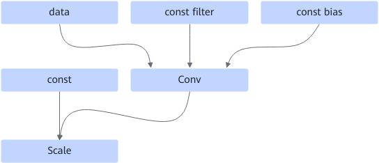

# ConvScaleFusionPass

## 融合模式

该融合规则将conv卷积算子和scale算子融合为conv卷积算子，filter输入替换为ConvScaleFilterHost算子，bias输入替换为ConvScaleBiasHost算子，提高计算性能：

融合成

## 使用约束

- 不支持动态场景。
- 不支持conv卷积算子的filter输入为QuantWeightRollBack。
- 不支持conv卷积算子多输出场景。
- filter，bias和scale节点的另一路输入必须为const。

## 支持的型号

<!-- npu="310p" id1 -->
Atlas 推理系列产品
<!-- end id1 -->

<!-- npu="310b" id2 -->
Atlas 200I/500 A2 推理产品
<!-- end id2 -->

<!-- npu="910" id3 -->
Atlas 训练系列产品
<!-- end id3 -->
