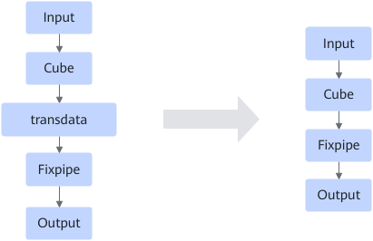

# CubeTransFixpipeFusionPass

## 融合模式

当匹配到下图结构时，将transdata节点后移用于匹配Fixpipe融合。

## 使用约束

- 仅支持静态场景
- Cube算子需要具有FixpipeAbility能力，详细请参见[FixPipeAbilityProcessPass](FixPipeAbilityProcessPass.md)。
- Cube节点的数据类型必须为float32。

## 支持的型号

<!-- npu="910b" id1 -->
Atlas A2 训练系列产品/Atlas A2 推理系列产品
<!-- end id1 -->
