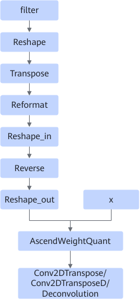

# DeconvWeightTransFusionPass

## 融合模式

在int8量化场景下，对输入filter进行转置逆序。

融合为

- 当filter的维度不等于4时，会在filter后插入complement\_dimension节点。
- 当filter的shape中H和W维度都不为1时，会在Reformat后依次插入reshape\_in，reverse和reshape\_out节点。
- 所有插入节点都会进行常量折叠。

## 使用约束

- int8量化场景下，该融合生效。
- AscendWeightQuant的filter输入仅支持const并且为int8类型。
