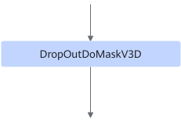
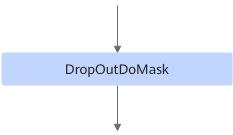

# DropOutDoMaskFusionPass

## 融合模式

该融合规则替换DropOutDoMaskV3D算子为DropOutDoMask。

融合后DropOutDoMaskV3D算子替换为DropOutDoMask算子，DropOutDoMask算子使用DSL分支通过Elemwise模板实现，支持UB融合。

融合成

## 使用约束

- 在支持DSA模块时融合规则生效且必须打开。
- 在需要DropOutDoMask算子进行UB融合时该融合规则必须打开。
- DropOutDoMaskV3D的其中一个父节点需要是DSAGenBitMask，作为mask输入。

## 支持的型号

<!-- npu="910b" id1 -->
Atlas A2 训练系列产品/Atlas A2 推理系列产品
<!-- end id1 -->

<!-- npu="A3" id2 -->
Atlas A3 训练系列产品/Atlas A3 推理系列产品
<!-- end id2 -->
