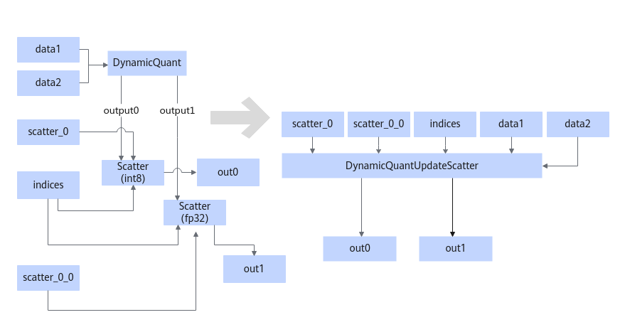
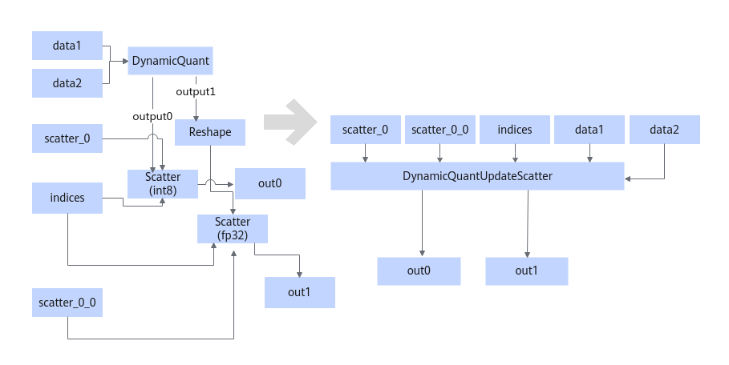

# DynamicQuantUpdateScatterFusionPass

## 融合模式

将满足如下Pattern的结构融合成DynamicQuantUpdateScatter算子。

或

或

## 使用约束

- 必须是DynamicQuant的两个输出，一个输出给一个Scatter算子，且两个Scatter共用一个indices输入，同时两个Scatter的input0来自于不同的节点，两个Scatter的axis相同。
- DynamicQuant的output0为int8数据类型，output1为fp32。
- DynamicQuant的输入dtype必须为float16或者bfloat16，且input1如果存在。input1的shape必须是1维，且等于input0的最后一维。
- DynamicQuant的输出都是作为Scatter的第三个update的输入。

## 支持的型号

<!-- npu="910b" id1 -->
Atlas A2 训练系列产品/Atlas A2 推理系列产品
<!-- end id1 -->
