# EinsumPass

## 融合模式

该融合规则根据Einsum算子的表达式构造出对应的计算图。如下所示计算图中的虚线节点皆为根据实际表达式可能添加的算子。

- **静态shape场景**包括如下两种情况：

  静态shape、单输入情况：

  

  融合成

  

  静态shape、双输入情况（视具体表达式而定，MatMul类算子的两个输入顺序可能互换）：

  

  融合成

  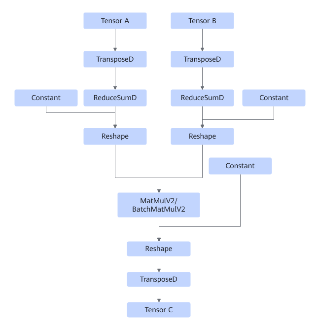

- **存在动态shape的场景**下，融合前Einsum算子所属的图皆为双输入情况，如下图所示：

  

  存在动态shape的场景目前支持14种表达式对应的情况，融合后的图具体如下所示：

 1. Einsum表达式形如"abc,cde-\>abde"：

    

 2. Einsum表达式形如"abcd,aecd-\>aceb"（BatchMatMul算子的两个输入交换顺序）：

    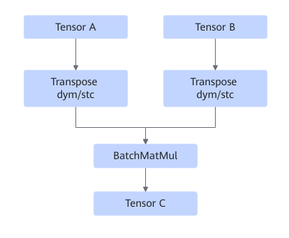

 3. Einsum表达式形如"abcd,adbe-\>acbe"：

    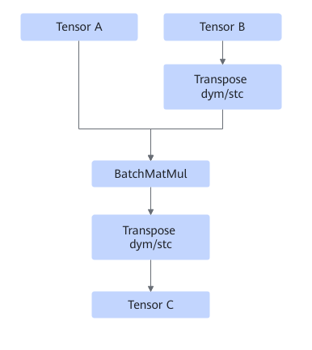

 4. Einsum表达式形如"abcd,cde-\>abe"：

    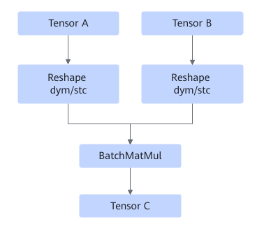

 5. Einsum表达式形如"abc,cd-\>abd"：

    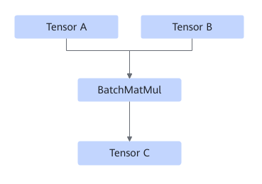

 6. Einsum表达式形如"abc,dc-\>abd"：

    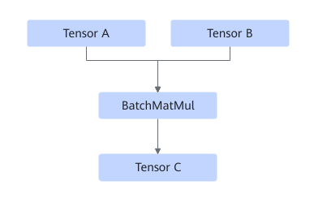

 7. Einsum表达式形如"abc,abd-\>dc"（MatMulV2算子的两个输入交换顺序）：

    

 8. Einsum表达式形如"abc,dec-\>abde"：

    

 9. Einsum表达式形如"abc,abde-\>dec"：

    TensorB为静态shape的情况：

    TensorB为动态shape的情况：

    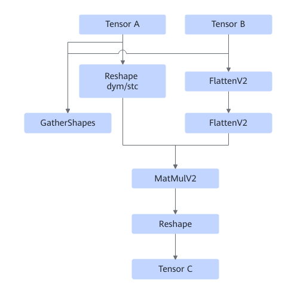

10. Einsum表达式形如"abcd,aecd-\>acbe"：

    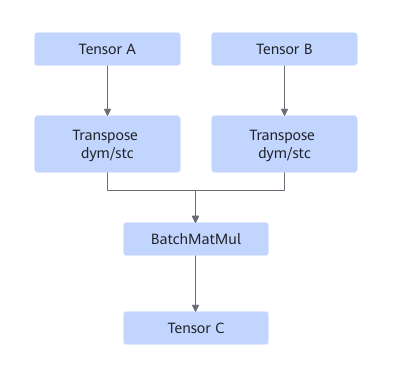

11. Einsum表达式形如"abcd,acbe-\>aecd"：

    

12. Einsum表达式形如"abcd,ecd-\>abe"：

    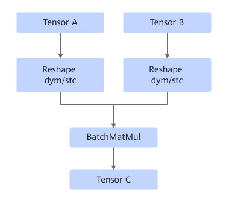

13. Einsum表达式形如"abcd,abe-\>ecd"：

    TensorA为静态shape的情况：

    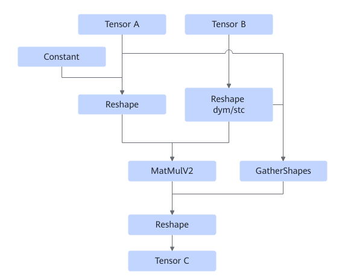

    TensorA为动态shape的情况：

    

14. Einsum表达式形如"abcd,acbe-\>adbe"：

    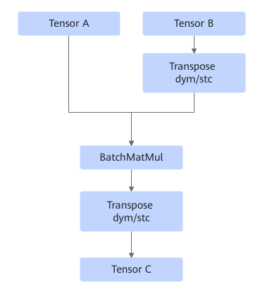

    根据输入shape是否为动态，以上图示中的**Reshape dym/stc**节点具体包含的算子如下所示：

    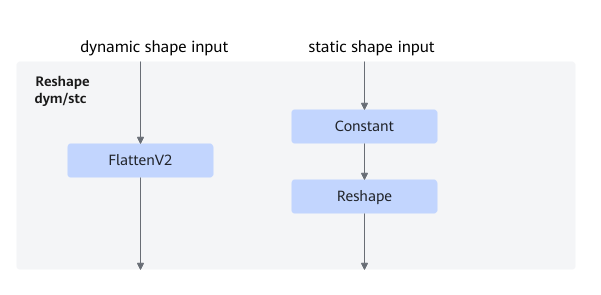

    根据输入shape是否为动态，以上图示中的**Transpose dym/stc**节点具体包含的算子如下所示：

    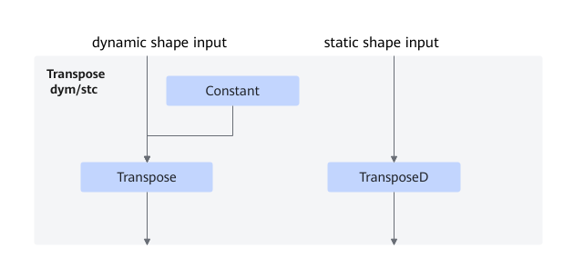

- Einsum表达式形如"abcd, abde-\>abce"：

    

- Einsum表达式形如"abcd, abce-\>abde"：

    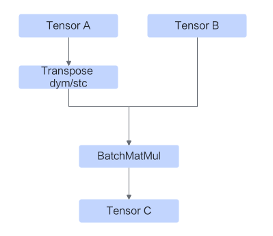

    根据输入shape是否为动态，以上图示中的**Transpose dym/stc**节点具体包含的算子如下所示：

    

- Einsum表达式形如"abcd, aebd-\>aebc"：

    

    根据输入shape是否为动态，以上图示中的**Reshape**节点具体包含的算子如下所示：

    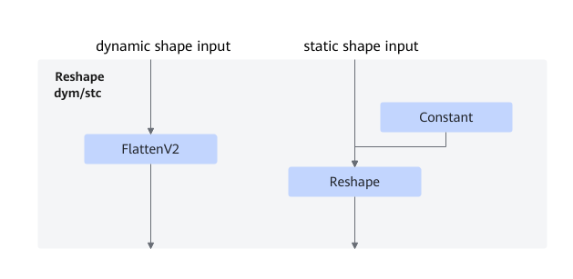

- Einsum表达式形如"abcd, abce-\>acde"：

    

    根据输入shape是否为动态，以上图示中的**Reshape**节点具体包含的算子如下所示：

    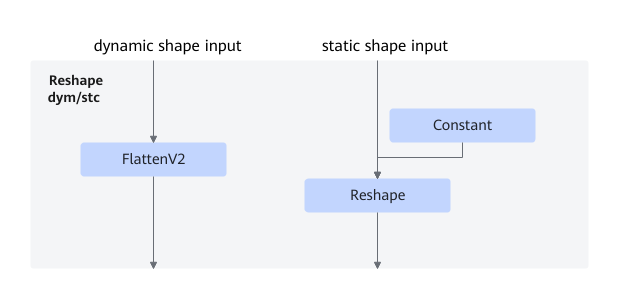

- Einsum表达式形如"abc, abd-\>acd"：

    

    根据输入shape是否为动态，以上图示中的**Transpose dym/stc**节点具体包含的算子如下所示：

    

- Einsum表达式形如"ab, cb-\>ac"：

    

    根据输入shape是否为动态，以上图示中的**Transpose dym/stc**节点具体包含的算子如下所示：

    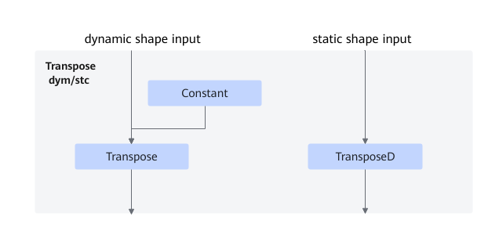

- Einsum表达式形如"abc, acd-\>abd"：

    

- Einsum表达式形如"abc, adc-\>abd"：

    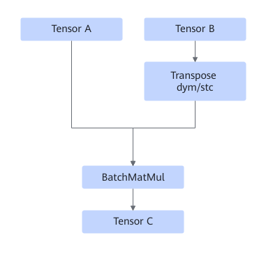

    根据输入shape是否为动态，以上图示中的**Transpose dym/stc**节点具体包含的算子如下所示：

    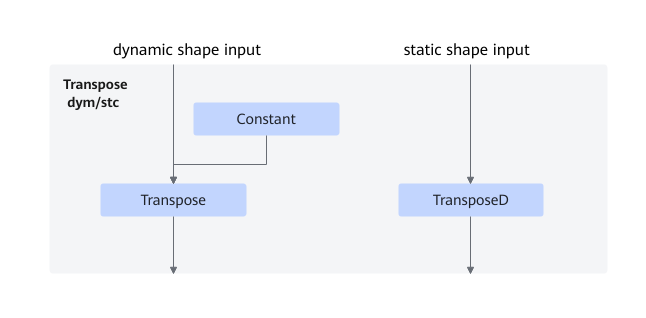

- Einsum表达式形如"abcd, ced-\>abce"：

    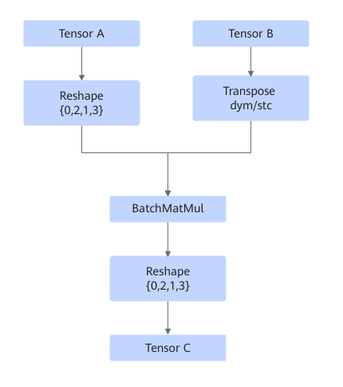

    根据输入shape是否为动态，以上图示中的**Reshape**节点具体包含的算子如下所示：

    

    根据输入shape是否为动态，以上图示中的**Transpose dym/stc**节点具体包含的算子如下所示：

    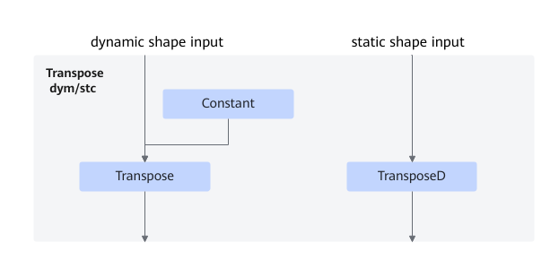

- Einsum表达式形如"abcd, ebcd-\>bcae"：

    

    根据输入shape是否为动态，以上图示中的**Reshape**节点具体包含的算子如下所示：

    

    根据输入shape是否为动态，以上图示中的**Transpose dym/stc**节点具体包含的算子如下所示：

    

- Einsum表达式形如"abcd, dabe-\>cabe"：

    

    根据输入shape是否为动态，以上图示中的**Reshape**节点具体包含的算子如下所示：

    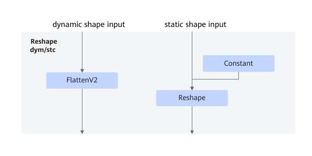

- Einsum表达式形如"a, b-\>ab"：

    

- Einsum表达式形如"abcd, aecd-\>eb"：

    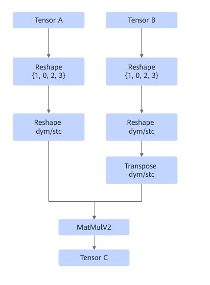

    根据输入shape是否为动态，以上图示中的**Reshape**节点具体包含的算子如下所示：

    

    根据输入shape是否为动态，以上图示中的**Transpose dym/stc**节点具体包含的算子如下所示：

    

- Einsum表达式形如"abcd, eb-\>aecd"：

  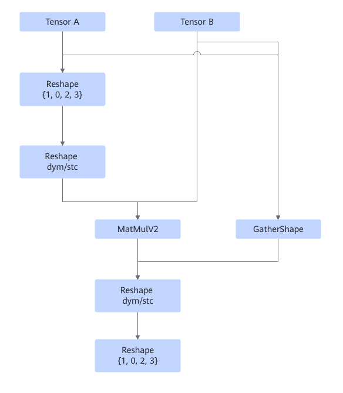

  根据输入shape是否为动态，以上图示中的**Reshape**节点具体包含的算子如下所示：

  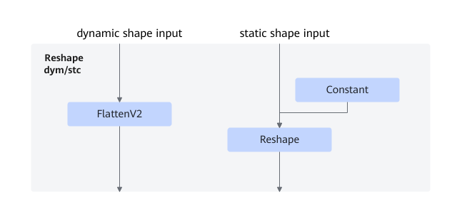

- 其他动态shape场景包括如下两种情况：
    1. 单输入情况：

        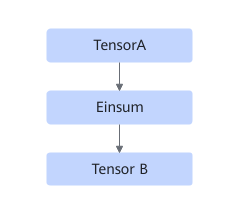

        融合后

        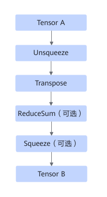

    2. 双输入情况：
        1. 场景一

            

            融合后

            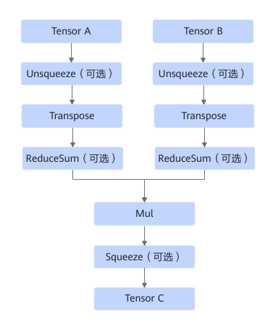

            Unsqueeze、ReduceSum和Squeeze都为可选，且都可以有多个。

        2. 场景二

            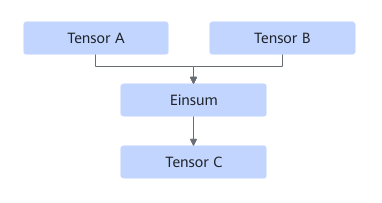

            融合后

            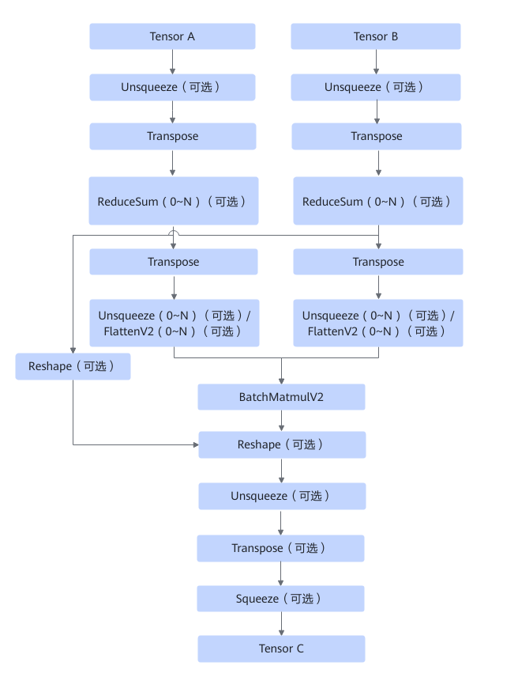

            Unsqueeze、ReduceSum、Unsqueeze/FlattenV2、Reshape、Transpose和Squeeze都为可选，且ReduceSum和Unsqueeze/FlattenV2可以有多个。

## 使用约束

- 该融合规则默认开启且不能关闭。
- Einsum算子的输入数量只能是1或2，且输入Tensor的元素数量没有溢出int64的表示范围。
- 静态shape场景下，仅支持单输入单输出或者双输入单输出形式的Einsum表达式。
- 静态shape场景下，不支持输入或输出表达式中存在重复的维度label。
- 静态shape场景下，当融合后的算子为BatchMatMul时，输入Tensor的数据类型仅支持float16,  float32。
- 存在动态shape的场景下，仅支持以下这些形式的Einsum表达式（具体维度label仅为示例），共14个："abc,cde-\>abde", "abcd,aecd-\>aceb", "abcd,adbe-\>acbe", "abcd,cde-\>abe", "abc,cd-\>abd", "abc,dc-\>abd", "abc,abd-\>dc", "abc,dec-\>abde", "abc,abde-\>dec", "abcd,aecd-\>acbe", "abcd,acbe-\>aecd", "abcd,ecd-\>abe", "abcd,abe-\>ecd", "abcd,acbe-\>adbe"，如果是单输入的Einsum算子，则该输入不能为动态shape。
- 存在动态shape的情况下，输入的维度数应当与对应的Einsum输入表达式中维度数一致。
- 动态shape场景下，支持单输入单输出，或者双输入单输出，或者输出为空的Einsum表达式。不支持输入或输出的表达式中有重复的维度label，输出的维度label要在输入中出现过。
- 动态shape场景下，只支持四维以内的输入tensor。

## 支持的型号

<!-- npu="910b" id1 -->
Atlas A2 训练系列产品/Atlas A2 推理系列产品
<!-- end id1 -->

<!-- npu="950" id2 -->
Ascend 950PR/Ascend 950DT
<!-- end id2 -->
