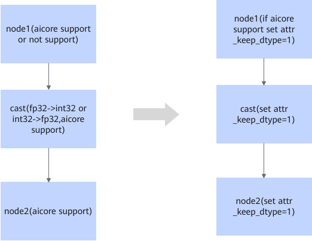

# ForceFp16CastFusionPass 

## 融合模式

针对cast算子中，输入和输出的数据类型为int32-\>fp32或fp32-\>int32时，可以通过设置attr\_keep\_dtype来提高精度。

## 使用约束

针对cast算子中，输入和输出的数据类型为int32-\>fp32或fp32-\>int32时，融合规则开启。

## 支持的型号

<!-- npu="910b" id1 -->
Atlas A2 训练系列产品/Atlas A2 推理系列产品
<!-- end id1 -->
