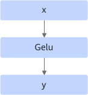
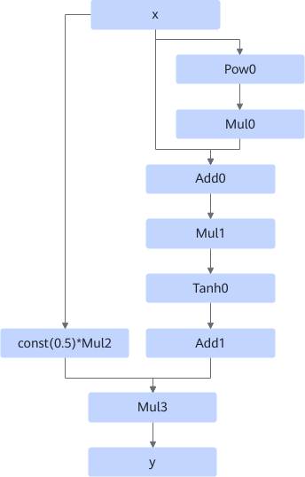
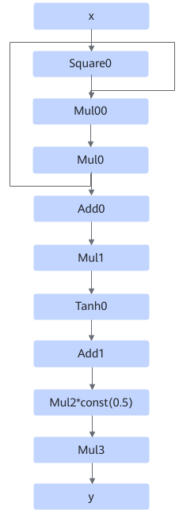
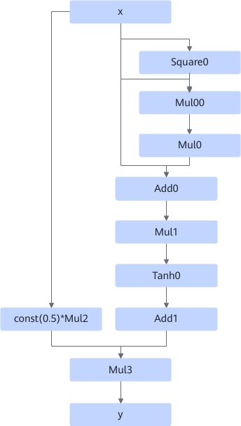

# GeluFusionPass

## 融合模式

该融合规则将Pow、Mul、Add、Tanh等小算子融合为Gelu算子。

计算公式：

- 场景一：

    
    
    融合为
    
    

- 场景二：

    
    
    融合为
    
    

- 场景三：

    
    
    融合为
    
    

- 场景四：

    
    
    融合为
    
    

- 场景五：

    
    
    融合为
    
    

- 场景六：

    
    
    融合为
    
    

- 场景七：

 
 
 融合为
 
 

- 场景八：

融合为

## 使用约束

- 不支持动态shape场景。
<!-- npu="910b" id2 -->
- 数据类型限制：
  - Atlas A2 训练系列产品/Atlas A2 推理系列产品：数据类型支持FLOAT32、FLOAT16、BFLOAT16。
<!-- end id2 -->

## 支持的型号

<!-- npu="910b" id1 -->
Atlas A2 训练系列产品/Atlas A2 推理系列产品
<!-- end id1 -->
