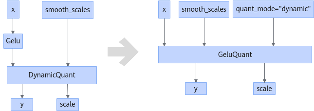

# GeluQuantFusionPass

## 融合模式

完成如下结构的融合，把小算子\(Gelu + AscendQuantV2\)或\(Gelu + DynamicQuant\)融合成大算子GeluQuant。

或

## 使用约束

- Gelu输入参数的shape仅支持大于等于2维。
- Gelu输出只连接一个节点AscendQuantV2或DynamicQuant。
- AscendQuantV2或DynamicQuant算子的输出y的类型为int8。
- 当Gelu和下游的AscendQuantV2算子融合时，AscendQuantV2的sqrt\_mode属性为false，AscendQuantV2的round\_mode属性为"round"，AscendQuantV2的dst\_type属性为int8。

## 支持的型号

<!-- npu="910b" id1 -->
Atlas A2 训练系列产品/Atlas A2 推理系列产品
<!-- end id1 -->
