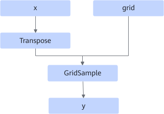
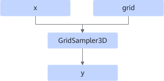
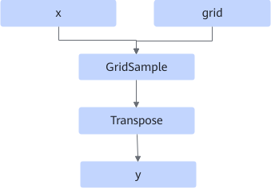

# GridSampler3DFusionPass

## 融合模式

该融合规则主要是使用GridSample算子替换GridSampler3D算子。

- 场景一：输入的数据格式为NCDHW、ND。

  融合为

- 场景二：输入的数据格式为NDHWC。

  融合为

## 使用约束

- 不支持动态shape场景。
- 仅支持x、y数据格式为NCDHW、NDHWC、ND，shape为5维，且数据格式一致的场景。
- grid的shape必须为5维且最后一维值为3。
<!-- npu="910b" id2 -->
- 数据类型限制：
  - Atlas A2 训练系列产品/Atlas A2 推理系列产品：数据类型支持FLOAT32、FLOAT16。
  <!-- end id2 -->

## 支持的型号

<!-- npu="910b" id1 -->
Atlas A2 训练系列产品/Atlas A2 推理系列产品
<!-- end id1 -->
