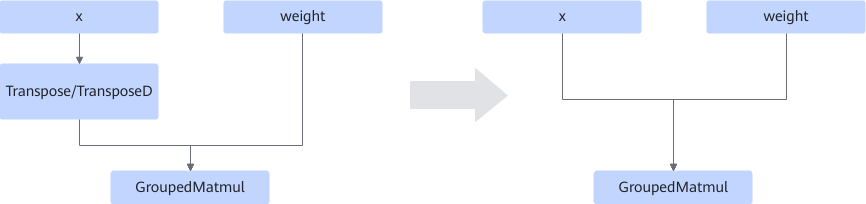
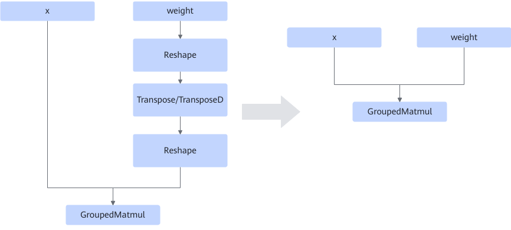
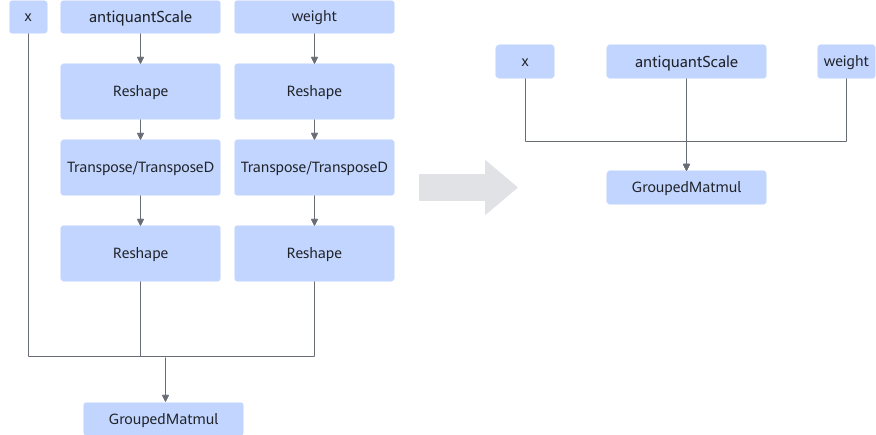
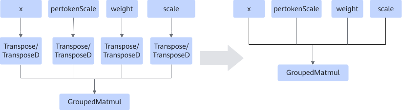

# GroupedMatmulTransFusionPass

## 融合模式

融合模式一：将Transpose或TransposeD从图中删除，并将x/weight转置信息添加在算子属性上。如下图所示。

<!-- npu="950,A3,910b" id2 -->
融合模式二：将x/weight前的Reshape+Transpose/TransposeD+Reshape从图中删除，并将x/weight转置信息打在算子属性上。如下图所示。

该融合模式支持的产品如下。

<!-- npu="910b" id3 -->
Atlas A2 训练系列产品/Atlas A2 推理系列产品
<!-- end id3 -->

<!-- npu="A3" id4 -->
Atlas A3 训练系列产品/Atlas A3 推理系列产品
<!-- end id4 -->

<!-- npu="950" id5 -->
Ascend 950PR/Ascend 950DT
<!-- end id5 -->

<!-- end id2 -->
<!-- npu="950" id1 -->
融合模式三：Ascend 950PR/Ascend 950DT的伪量化场景下，将weight/antiquantScale前的Reshape+Transpose/TransposeD+Reshape从图中删除，并将weight转置信息打在算子属性上。如下图所示。

融合模式四：Ascend 950PR/Ascend 950DT的MX/GB量化场景下，融合模式是：将Transpose或TransposeD从图中删除，并将x和weight的转置信息打在算子属性上。如下图所示：

>[!NOTE]说明
>Ascend 950PR/Ascend 950DT的MX/GB量化场景下，scale跟随weight的转置信息，pertokenScale跟随x的转置信息。
<!-- end id1 -->

## 使用约束

- 只支持输入x为单tensor、weight为单tensor、y为单tensor的场景（单tensor表示tensorList输入中只有一个tensor）。
- Transpose/TransposeD支持第二轴和第三轴转置。
