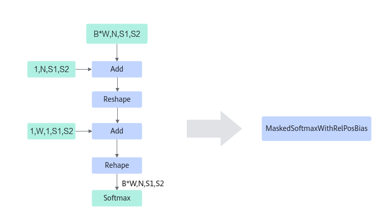
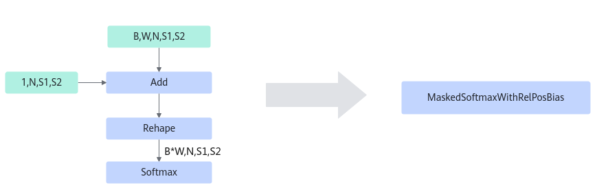

# MaskedSoftmaxWithRelPosBiasFusionPass 

## 融合模式

将符合如下模式中的Mul，Add，Reshape，Softmax融合成MaskedSoftmaxWithRelPosBias算子。

**模式一：**

**模式二：**

**模式三：**

**模式四：**

## 使用约束

输入只支持四维或者五维，每个融合模式都有对应输入的shape信息，按照该条件构造算子的输入，其中B，W，N，S1，S2表示每个shape的维度，scale表示输入是一个标量。

## 支持的型号

<!-- npu="310p" id1 -->
Atlas 推理系列产品
<!-- end id1 -->

<!-- npu="910b" id2 -->
Atlas A2 训练系列产品/Atlas A2 推理系列产品
<!-- end id2 -->

<!-- npu="A3" id3 -->
Atlas A3 训练系列产品/Atlas A3 推理系列产品
<!-- end id3 -->
