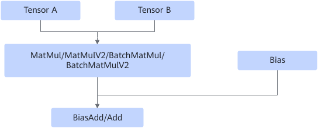

# MatMulBiasAddFusionPass

## 融合模式

将MatMul/MatMulV2/MatMulV3/BatchMatmul/BatchMatMulV2算子和biasadd/add算子融合为MatMul/MatMulV2/MatMulV3/BatchMatmul/BatchMatMulV2算子。

融合为

## 使用约束

- add算子的两个输入必须得有一个的维度为1。
- bias的数值大小与MatMul或MatMulV2/BatchMatMul/BatchMatMulV2输出的倒数第一维的数值大小保持一致。
- MatMul/MatMulV2的输出维度为2。
- 不支持broadcast。（broadcast是让两个shape不同的Tensor自动扩展成相同的shape，从而可以进行元素级的运算。broadcast的规则是从右往左检查两个Tensor的shape。如果某一边的维度是 1，那么它会自动扩展为与另一边相同。）
- 如果融合前的BiasAdd/Add是fp16计算，那么融合之后bias会在matmul内部使用fp32相加，会导致结果精度变化（精度提升），关闭MatMulBiasAddFusionPass后则不会出现以上精度变化。

## 支持的型号

<!-- npu="910b" id1 -->
Atlas A2 训练系列产品/Atlas A2 推理系列产品
<!-- end id1 -->

<!-- npu="A3" id2 -->
Atlas A3 训练系列产品/Atlas A3 推理系列产品
<!-- end id2 -->

<!-- npu="950" id3 -->
Ascend 950PR/Ascend 950DT
<!-- end id3 -->
