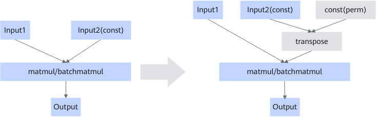

# MatMulTransposeWeightFusionPass

## 融合模式

二维矩阵的第一个轴为外轴，第二个轴为内轴，比如A = M x K中，内轴为K，转置之后A^T = k x M，内轴为M。

当matmul/batchmatmul算子输入shape内轴的存储单元不是512Byte的倍数时，MTE效率较低，性能表现较差。该图融合就是将matmul的输入shape内外轴置换，以达到内外轴对齐，解决性能问题。

## 支持的型号

<!-- npu="910b" id1 -->
Atlas A2 训练系列产品/Atlas A2 推理系列产品
<!-- end id1 -->
