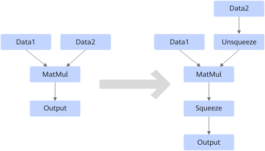
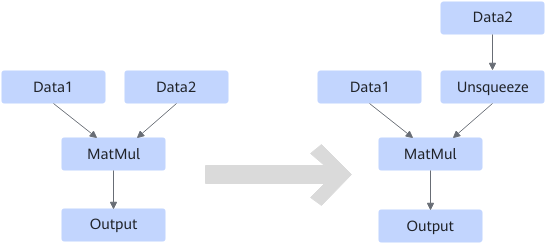

# MatMulUnsqueezeSqueezeFusionPass

## 融合模式

**融合模式一**

MatMul/MatMulV2/BatchMatmul/BatchMatmulV2支持1 dim x N dim和N dim x 1 dim的输入场景下，需要将1 dim的输入插入Unsqueeze算子扩成二维，输出插入Squeeze算子去掉对应的扩维轴。

**融合模式二**

MatMul/MatMulV2/BatchMatmul/BatchMatmulV2支持1 dim x 1 dim的输入场景下，需要将1 dim的输入插入Unsqueeze算子扩成二维。

**融合模式三**

MatMul/MatMulV2/BatchMatmul/BatchMatmulV2支持AscendDequant场景。

## 使用约束

无
