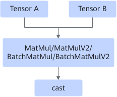
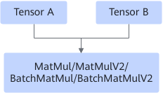

# MatmulCastFusionPass

## 融合模式

将MatMul/MatMulV2/BatchMatMul/BatchMatMulV2算子和cast算子融合为MatMul/MatMulV2/BatchMatMul/BatchMatMulV2算子。

融合为

## 使用约束

当MatMul的输入数据类型为float16，cast输出数据类型为float32时，该融合生效。

## 支持的型号

<!-- npu="310p" id1 -->
Atlas 推理系列产品
<!-- end id1 -->

<!-- npu="910" id2 -->
Atlas 训练系列产品
<!-- end id2 -->
