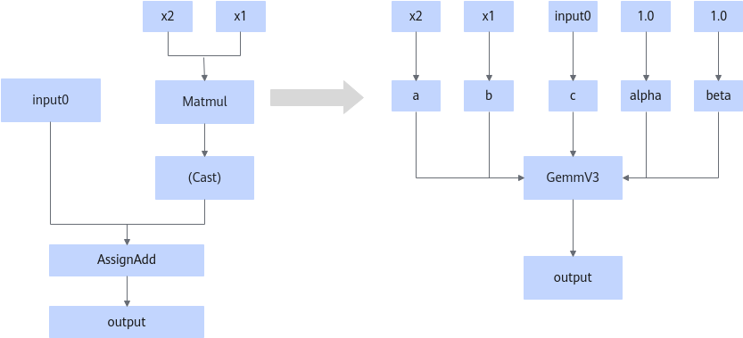

# MatmulToGemmOpFusionPass

## 融合模式

该融合将符合图融合pattern的MatMulV3/MatMulV2/MatMul的算子转换为GemmV3算子。

## 使用约束

- MatMul和AssignAdd节点之间的Cast节点可以不存在，支持不带Cast节点的匹配。
- MatMul类型包括MatMul/MatMulV2/MatMulV3。
- MatMul节点的输入dtype仅支持float16，float32和bfloat16。
- AssignAdd节点输入dtype仅支持float32。
- 不建议关闭，关闭后可能会影响网络精度。

## 支持的型号

<!-- npu="950" id1 -->
Ascend 950PR/Ascend 950DT
<!-- end id1 -->
