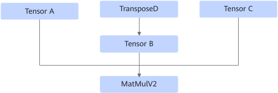

# Matmulv2FusionPass

## 融合模式

对于weight int8量化场景，输入数量为3的MatMulV2算子，该融合规则在需要转置的输入TensorB之前插入TransposeD算子。

融合成

## 使用约束

- MatMulV2的OpDesc必须有transpose\_b属性，且属性值为True。
- TensorB的维度数量应该为2，且数据类型为int8。
- 源框架matmul相关IR需要带有transpose\_b属性。
