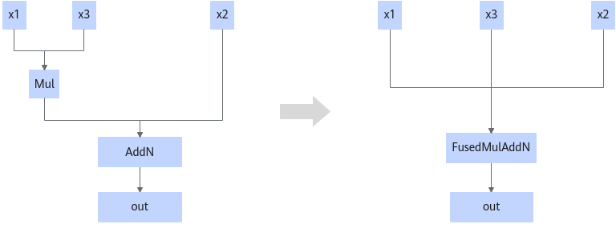

# MulAddNPass

## 融合模式

该融合规则在Mul节点个数大于2时，将多个Mul节点和AddN节点融合成一个MulAddN节点。

当AddN的输入节点数量n=2时，该融合规则将Mul和AddN融合为一个FusedMulAddN节点，要求Mul节点的其中一个输入必须是scalar或仅包含一个数的tensor。

## 使用约束

- 当Mul节点的个数大于2时：
  - 输入为动态shape，x1的输入shape为\[B,M,1\]，x2为\[B, 1,N\]。
  - x2的shape中N的最大值为2040。

- 当AddN的输入节点数量n=2时：
  - 输入数据x3的维度为scalar或仅包含一个数的tensor。
  - Mul节点必须作为AddN节点的第一个输入，否则不融合。

## 支持的型号

<!-- npu="910b" id1 -->
Atlas A2 训练系列产品
<!-- end id1 -->

<!-- npu="A3" id2 -->
Atlas A3 训练系列产品/Atlas A3 推理系列产品
<!-- end id2 -->

<!-- npu="950" id3 -->
Ascend 950PR/Ascend 950DT
<!-- end id3 -->
