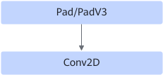

# PadConv2dFusionPass

## 融合模式

该融合将Pad/PadV3+Conv2D算子融合成Conv2D算子。

融合成

正向融合场景仅用于：Pad/PadV3+Conv2D图场景。

反向融合场景仅用于：训练网络中和该正向场景对应的反向过程，遇到Pad+Conv2DBackpropFilterD，会融合成新的Conv2DBackpropFilterD，消除Pad。遇到Conv2DBackpropInputD+ Slice，会融合成新的Conv2DBackpropInputD，消除Slice。

## 使用约束

- 不支持动态shape。
- 不支持Pad/PadV3算子连接多个Conv2D结构，融合前的结构的第一个节点仅与后一个节点连接，不会连接多个节点，如pad输出仅给一个Conv2D节点，不会给其他节点。
- 不支持paddings值<0。
- PadV3算子只支持mode为constant且constant\_values为0（dtype为fp32）的场景下进行融合。
- Pad/PadV3算子N/C维度pad只支持为0，支持在Conv2D的H/W维度补pad，融合后的pad大小要在\[0, 255\]区间内，融合后的pad\_top和pad\_bottom均小于kernel\_h。

## 支持的型号

<!-- npu="310p" id1 -->
Atlas 推理系列产品
<!-- end id1 -->

<!-- npu="310b" id2 -->
Atlas 200I/500 A2 推理产品
<!-- end id2 -->

<!-- npu="910" id3 -->
Atlas 训练系列产品
<!-- end id3 -->

<!-- npu="910b" id4 -->
Atlas A2 训练系列产品/Atlas A2 推理系列产品
<!-- end id4 -->

<!-- npu="A3" id5 -->
Atlas A3 训练系列产品/Atlas A3 推理系列产品
<!-- end id5 -->

<!-- npu="950" id7 -->
Ascend 950PR/Ascend 950DT
<!-- end id7 -->
