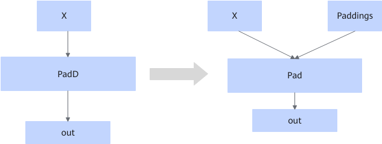

# PaddUpdateFusionPass 

## 融合模式

该融合将符合图融合pattern的PadD算子，在静态场景下且非5HD场景下，将图中的PadD算子改为Pad算子，并将属性转换为输入。

## 使用约束

- 动态场景不生效。
- 输入format为5HD不生效。
- 输入输出shape相等时不生效。
- 输入shape在黑名单\{1,3200,256\}中不生效。
- 单算子模式默认开启，可以选择关闭此规则。

## 支持的型号

<!-- npu="910b" id1 -->
Atlas A2 训练系列产品/Atlas A2 推理系列产品
<!-- end id1 -->
