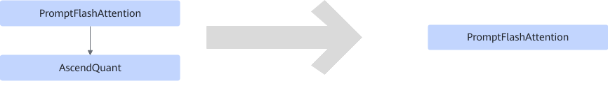

# PromptFlashAttentionQuantFusionPass

## 融合模式

量化场景，将PromptFlashAttention+AscendQuant融合为PromptFlashAttention算子，quant的scale和offset转化为pfa的quant\_scale2和quant\_offset2入参。

## 使用约束

- 仅支持PromptFlashAttention为fp16输出。
- 仅支持AscendQuant为fp16输入int8输出。
- PromptFlashAttention算子的quant\_scale2和quant\_offset2必须为空。
- PromptFlashAttention算子必须为单输出。

## 支持的型号

<!-- npu="910b" id1 -->
Atlas A2 训练系列产品/Atlas A2 推理系列产品
<!-- end id1 -->

<!-- npu="A3" id2 -->
Atlas A3 训练系列产品/Atlas A3 推理系列产品
<!-- end id2 -->
