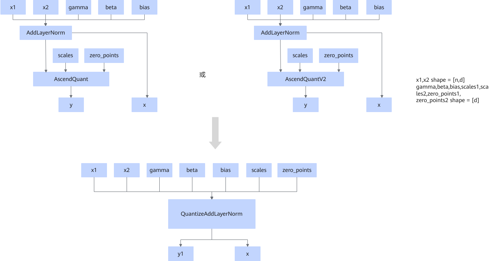
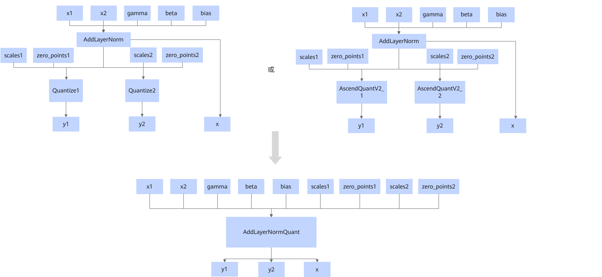

# QuantizeAddLayerNormPass

## 融合模式

场景1：将算子AddLayerNorm的输出y所连接的两个Quantize算子或两个AscendQuantV2算子融合掉，融合成新算子DuaQuantizeAddLayerNorm。

场景2：将算子AddLayerNorm的输出y所连接的1个AscendQuant或AscendQuantV2算子节点融合掉，融合成新算子QuantizeAddLayerNorm：

场景3：在Ascend 950PR/Ascend 950DT产品平台下，将AddLayerNorm算子和其后面链接的1个或2个Quantize或AscendQuantV2算子融合为AddLayerNormQuant算子

## 使用约束

  <!-- npu="950" id5 -->
- Ascend 950PR/Ascend 950DT场景下
  - 量化节点须为Quantize或AscendQuantV2。支持单路量化或双路量化，双路量化时，须两个量化的节点类型一致。量化类型仅支持int8。
  - AddLayerNorm的输入参数x1的数据类型为bf16、fp16、fp32。其他输入参数的数据类型须与x1保持一致。AddLayerNorm输出无mean或rstd。
  - 当量化节点为Quantize时，其输入参数x的数据类型须与AddLayerNorm的输入参数x1的数据类型一致。其输入参数scale的数据类型须为fp32或与AddLayerNorm的输入参数x1的数据类型一致。
  <!-- end id5 -->

  <!-- npu="A3,910b" id4 -->
- Atlas A2 训练系列产品/Atlas A2 推理系列产品和Atlas A3 训练系列产品/Atlas A3 推理系列产品场景下
  - AddLayerNorm的输入参数个数至少为5，且参数bias必须存在。
  - 融合为DuaQuantizeAddLayerNorm算子的场景，AddLayerNorm节点后须连接两个量化节点，AddLayerNorm的输入参数x1的数据类型须为bf16，且须尾轴32B对齐。
  - 融合为QuantizeAddLayerNorm算子的场景，AddLayerNorm节点后须连接单个量化节点，当量化节点为AscendQuant时，AddLayerNorm的输入参数x1的数据类型须不为fp32，且尾轴须32B对齐。
  <!-- end id4 -->

## 支持的型号

<!-- npu="910b" id1 -->
Atlas A2 训练系列产品/Atlas A2 推理系列产品
<!-- end id1 -->

<!-- npu="A3" id2 -->
Atlas A3 训练系列产品/Atlas A3 推理系列产品
<!-- end id2 -->

<!-- npu="950" id3 -->
Ascend 950PR/Ascend 950DT
<!-- end id3 -->
