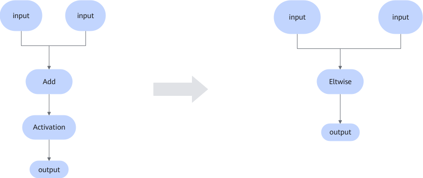

# ReluFusionPass

## 融合模式

caffe框架下，该融合会匹配到如下特定图结构，匹配成功后，转成随路指令完成激活函数的计算。

**结构一**：

**结构二：**

## 使用约束

Add算子的输入需要是Convolution、Activation、FusionBatchNorm、BatchNorm、Pooling或者Eltwise。

Activation的Mode属性取值为Relu。

## 支持的型号

<!-- npu="310b" id3 -->
Atlas 200I/500 A2 推理产品
<!-- end id3 -->

<!-- npu="310p" id4 -->
Atlas 推理系列产品
<!-- end id4 -->

<!-- npu="910" id5 -->
Atlas 训练系列产品
<!-- end id5 -->Atlas 训练系列产品

<!-- npu="910b" id1 -->
Atlas A2 训练系列产品/Atlas A2 推理系列产品
<!-- end id1 -->

<!-- npu="A3" id2 -->
Atlas A3 训练系列产品/Atlas A3 推理系列产品
<!-- end id2 -->
