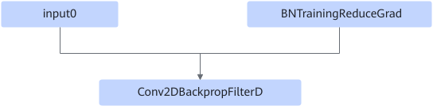

# Resnet50DbnDwFusionPass

## 融合模式

该融合规则将在Conv2DBackpropFilterD算子前添加BNTrainingReduceGrad，融合成FusedDbnDw算子。

融合成

## 使用约束

非普通融合，仅针对Resnet50网络上特定shape做此融合。

## 支持的型号

<!-- npu="910" id1 -->
Atlas 训练系列产品
<!-- end id1 -->
