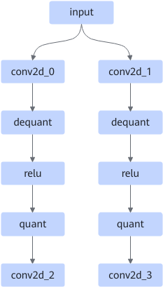
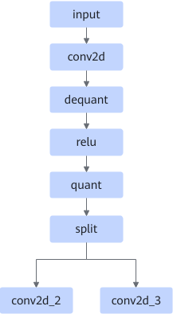

# SameInputConv2dFixpipePass

## 融合模式

该融合将符合约束条件的多路Conv2D+AscendDequant+Relu+AscendQuant算子融合成一路Conv2D+AscendDequant+Relu+AscendQuant+Split融合算子，如下图所示。

融合成

## 使用约束

- 每路第一个Conv2D（图上conv2d\_0和conv2d\_1）的规格及属性需要完全一致，且其属性值output\_channel需要是32的倍数。
- 仅支持静态输入shape（fmap, filter, bias）。
- 仅支持每路第一个Conv2D groups为1。

## 支持的型号

<!-- npu="310b" id1 -->
Atlas 200I/500 A2 推理产品
<!-- end id1 -->

<!-- npu="910b" id2 -->
Atlas A2 训练系列产品/Atlas A2 推理系列产品
<!-- end id2 -->

<!-- npu="A3" id3 -->
Atlas A3 训练系列产品/Atlas A3 推理系列产品
<!-- end id3 -->
