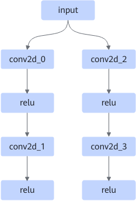
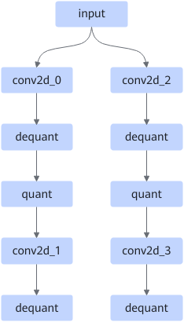

# SameInputConv2dPass

## 融合模式

非量化场景：该融合将符合约束条件的多路Conv2D+Relu算子融合成一路Conv2D+Relu+Split融合算子，如下图所示。

融合成

量化场景：

该融合将符合约束条件的多路Conv2D+AscendRequant算子融合成一路Conv2D+AscendRequant+Split融合算子，如下图所示。

融合成

该融合将符合约束条件的多路Conv2D+AscendDequant+AscendQuant算子融合成一路Conv2D+AscendDequant+AscendQuant+Split融合算子，如下图所示。

融合成

## 使用约束

- 仅支持静态输入shape（fmap, filter, bias）。
- 仅支持Conv2D groups为1。
- 每路第一个Conv2D（图示中conv2d\_0与conv2d\_2）的filter batch之和需为16的倍数，如果fmap的data type为int8，filter batch之和需为32的倍数。
- filter仅支持const、RequantHostCpuOp、ConvBnFilterHost、AscendWeightQuant节点。
- 非量化场景下，仅支持最后的节点为relu或conv2d。
- 量化场景下，仅支持以dequant/requant/conv2d节点结尾。

## 支持的型号

<!-- npu="310p" id1 -->
Atlas 推理系列产品
<!-- end id1 -->

<!-- npu="310b" id2 -->
Atlas 200I/500 A2 推理产品
<!-- end id2 -->

<!-- npu="910" id3 -->
Atlas 训练系列产品
<!-- end id3 -->
