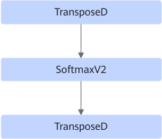

# SoftmaxFusionPass

## 融合模式

该融合规则将SoftmaxV2输入和输出添加TransposeD算子。

融合为

## 使用约束

- 输入shape约束：

    输入仅支持三维或者五维。

  - 当输入是三维时，输入shape最后两维度大小分别是\{8732, 21\}。
  - 当输入是五维时，输入shape最后四维度大小分别是\{224, 224, 160, 4\}。

- 输入参数的大小约束：

    输入参数的大小（元素个数×dtype大小）不得超过int32的最大值：231-1。

- 输入属性约束：

    仅支持属性axes的第一个值指定最后一个轴。

## 支持的型号
<!-- npu="A3" id1 -->
Atlas A3 训练系列产品/Atlas A3 推理系列产品
<!-- end id1 -->

<!-- npu="910b" id2 -->
Atlas A2 训练系列产品/Atlas A2 推理系列产品
<!-- end id2 -->

<!-- npu="310b" id3 -->
Atlas 200I/500 A2 推理产品
<!-- end id3 -->

<!-- npu="310p" id4 -->
Atlas 推理系列产品
<!-- end id4 -->

<!-- npu="910" id5 -->
Atlas 训练系列产品
<!-- end id5 -->
