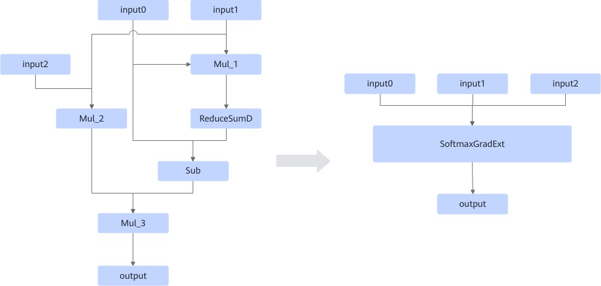

# SoftmaxGradExtFusion

## 融合模式

该融合将符合下图左侧图结构的Mul、ReduceSumD、Sub这些小算子，融合成下图右侧的SoftmaxGradExt算子。

## 使用约束

- 输入约束：
  - Mul\_1节点的输入与Sub节点的第一个输入共用input0。
  - Mul\_1节点的输入与Mul\_2节点的输入共用input1。
  - ReduceSumD的axis参数必须为-1，keep\_dims参数必须为True。

- 数据格式和shape约束：
  - input0、input1的shape必须是4D\~8D。
  - input0和input1的shape最后两位必须是16，且数据格式为NZ。
  - input2的类型必须是scalar。

- 不支持动态shape场景。
- 数据类型约束：
  - input0、input1、input2的数据类型需要保持一致。
  - Atlas A2 训练系列产品/Atlas A2 推理系列产品：数据类型支持FLOAT16、FLOAT32、BFLOAT16。

## 支持的型号

<!-- npu="910b" id1 -->
Atlas A2 训练系列产品/Atlas A2 推理系列产品
<!-- end id1 -->

<!-- npu="950" id2 -->
Ascend 950PR/Ascend 950DT
<!-- end id2 -->