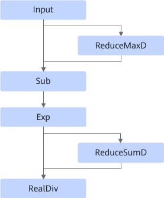
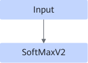

# SoftmaxSmallOpFusionPass

## 融合模式

该融合规则将ReduceMaxD、Sub等小算子组合识别并融合为SoftmaxV2算子。

该融合规则默认关闭。

融合为

## 使用约束

- 不支持动态shape场景。
- ReduceMaxD和ReduceSumD的输入参数约束：
  - 参数axes应保持一致。
  - 参数keep\_dims的值为true。

- 在reduce轴为1且AReduceSumFusionPass融合规则开启时，当前融合规则不生效。
- 在reduce轴超过一个并包含尾轴，数据类型为FLOAT32，且ReduceMaxDFusionPass融合规则开启时，当前融合规则不生效。
<!-- npu="910b" id2 -->
- 数据类型限制：
  - Atlas A2 训练系列产品/Atlas A2 推理系列产品：数据类型支持FLOAT32、FLOAT16、BFLOAT16。
<!-- end id2 -->

## 支持的型号

<!-- npu="910b" id1 -->
Atlas A2 训练系列产品/Atlas A2 推理系列产品
<!-- end id1 -->
