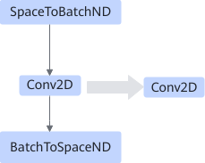

# SpaceToBatchConv2dBatchToSpacePass

## 融合模式

该融合将顺序连接的SpaceToBatchND、Conv2D、BatchToSpaceND算子融合为Conv2D算子，如下图所示。

## 使用约束

- SpaceToBatchND/Conv2D/BatchToSpaceND只能是单输出。
- BatchToSpaceND的权重维度必须为2，包括：block\_shape和crops。
- BatchToSpaceND的crops必须为0。
- Conv2D的strides必须等于\[1, 1, 1, 1\]。
- Conv2D的pads必须等于\[0, 0, 0, 0\]。
- SpaceToBatchND和BatchToSpaceND的block\_shape必须完全相等。
- 每个维度：dilations\(Conv2D\) \* block\_shape\(BatchToSpaceND\) <= 255。
- 每个维度：0 <= padding\(SpaceToBatchND\) <= 255。

## 支持的型号

<!-- npu="310p" id1 -->
Atlas 推理系列产品
<!-- end id1 -->

<!-- npu="310b" id2 -->
Atlas 200I/500 A2 推理产品
<!-- end id2 -->

<!-- npu="910" id3 -->
Atlas 训练系列产品
<!-- end id3 -->
