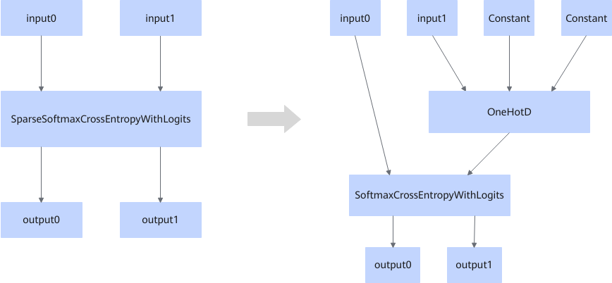

# SparseSoftMaxFusionPass

## 融合模式

该融合将符合图融合pattern的SparseSoftmaxCrossEntropyWithLogits算子，融合成OneHotD + SoftmaxCrossEntropyWithLogits算子。

## 使用约束

- 不支持动态shape场景。
- input0数据类型仅支持float16、float32。
- input1数据类型仅支持int32。

## 支持的型号

<!-- npu="910b" id1 -->
Atlas A2 训练系列产品/Atlas A2 推理系列产品
<!-- end id1 -->
