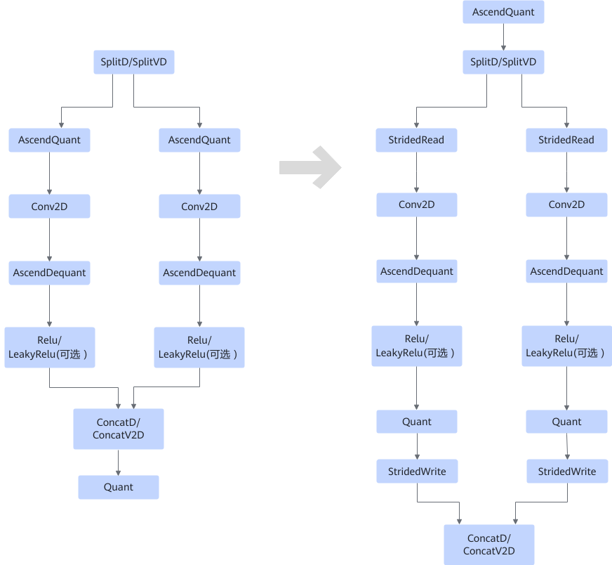
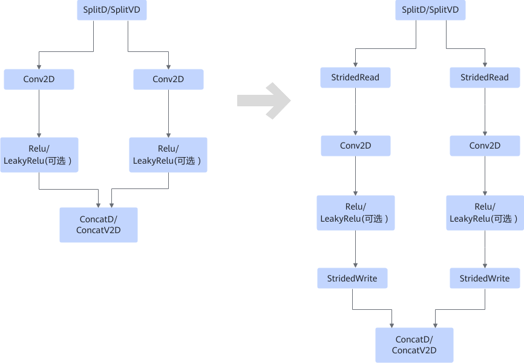
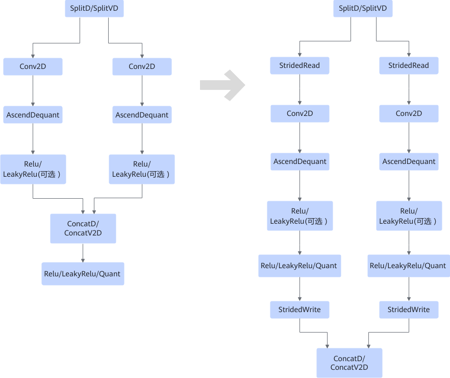

# SplitConvConcatFusionPass

## 融合模式

对如下几种场景进行融合：

**场景一**

- 当ConcatD/ConcatV2D的输出节点不是Quant时，融合场景如下。

    

- 当ConcatD/ConcatV2D的输出节点是Quant时，融合场景如下。

    

**场景二**

- 当ConcatD/ConcatV2D的输出节点不是Relu/LeakyRelu/Quant时，融合场景如下。

    

- 当ConcatD/ConcatV2D的输出节点是Relu/LeakyRelu/Quant时，融合场景如下。

    

**场景三**

- 当ConcatD/ConcatV2D的输出节点不是Relu/LeakyRelu/Quant时，融合场景如下。

    

- 当ConcatD/ConcatV2D的输出节点是Relu/LeakyRelu/Quant时，融合场景如下。

    

## 使用约束

- ConcatD/ConcatV2D至少有两个不同输入节点。
- SplitD/SplitVD输出和ConcatD/ConcatV2D输入（最后一个输入除外）的dim轴必须是C轴，C轴与dtype对齐。
    - 原始dtype为fp16和float时，dim C轴需要为16的倍数。
    - 原始dtype为int8，dim C轴需要为32的倍数。
    - 原始dtype为int4，dim C轴需要为64的倍数。

- ConcatD/ConcatV2D所有输入是4维，并且输入format为NCHW或者NHWC。
- SplitD/SplitVD至少有两个不同输出节点。
- ConcatD/ConcatV2D输入路数和SplitD/SplitVD输出路数一致。
- SplitD/SplitVD连接的AscendQuant算子的scale、offset、sqrt\_mode属性需要一致。
- 如果ConcatD/ConcatV2D输出节点中存在一个输出节点类型为NETOUTPUT，并且其主格式或存储格式为FORMAT\_NC1HWC0，则该pass不生效；如果ConcatD/ConcatV2D输出节点中存在一个输出节点的类型为QUANT、LEAKYRELU或RELU，且该节点的输出节点为NETOUTPUT并且主格式或存储格式为FORMAT\_NC1HWC0，则该pass不生效。
- SplitD/SplitVD的输入不为空，并且其第一个输入节点不属于Data或RefData。

## 支持的型号

该Pass的有效性依赖于目标平台是否支持相应算子类型，具体信息请参考《算子库》中的“[Ascend IR算子规格说明](https://www.hiascend.com/document/detail/zh/CANNCommunityEdition/latest/API/aolapi/operatorlist_00094.html)”章节。
