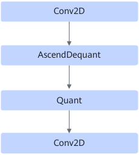
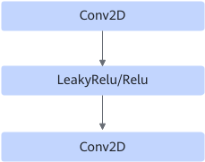
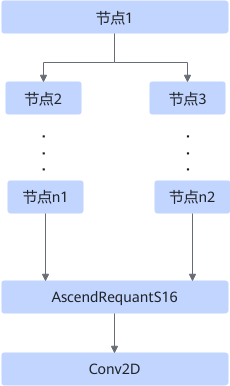

# StrideHoistingPass

## 融合模式

该融合主要是根据不同的图结构插入ReadSelect算子；如果匹配到Conv2D，会修改Conv2D的shape和属性。最终目的是让计算量减半。

**场景一：**

**场景二：**

**场景三：**

**场景四：**

**场景五：**

## 使用约束

- 场景一、二、五的约束如下
    - 节点1到节点n1的路径长度和节点1到节点n2的路径长度都小于10，且节点2到节点n1或者节点3到节点n2的路径上至少有一个Conv2D，无Conv2D的路径上，节点1需与Eltwise/AscendRequantS16直连（融合后，会在节点1与Eltwise/AscendRequantS16之间插入ReadSelect）。且Conv2D的属性有如下要求。

        **表 1**  Conv2D属性要求

        |第二个输出filter的H和W维度值|算子描述stride参数中H和W维度值|算子描述pads参数中H和W维度值|算子描述dilations参数中H和W维度值|
        |--|--|--|--|
        |3|1|1|1|
        |5|1|2|1|
        |7|1|3|1|

    - 路径上所有节点需要在白名单中，白名单包括CONV2D、ELTWISE、RELU、LEAKY\_RELU、ASCEND\_QUANT、ASCEND\_DEQUANT、ASCEND\_REQUANT、ASCEND\_REQUANTS16、ASCEND\_DEQUANTS16。

- 场景三、四的约束如下
    - 图中第一个Conv2D为单输出。
    - 图中第一个Conv2D的第一个输入x的H和W轴为静态。

- 所有图中最后一个Conv2D节点的属性有如下要求。

    **表 2**  最后一个Conv2D属性要求

    |第二个输出filter的H和W维度值|算子描述stride参数中H和W维度值|算子描述pads参数中H和W维度值|算子描述dilations参数中H和W维度值|
    |--|--|--|--|
    |1|2|0|1|

## 支持的型号

<!-- npu="310p" id1 -->
Atlas 推理系列产品
<!-- end id1 -->

<!-- npu="310b" id2 -->
Atlas 200I/500 A2 推理产品
<!-- end id2 -->

<!-- npu="910" id3 -->
Atlas 训练系列产品
<!-- end id3 -->

<!-- npu="910b" id4 -->
Atlas A2 训练系列产品/Atlas A2 推理系列产品
<!-- end id4 -->
