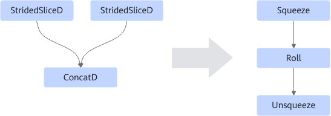

# StridedSliceConcatFusionPass

## 融合模式

该融合规则将StridedSliceD/StridedSliceD/ConcatD算子融合成Squeeze/Roll/Unsqueeze，提高计算性能。如下图所示：

该融合规则默认关闭。

## 使用约束

满足如下条件时，该融合规则不生效。

- concat\_dim不为1。
- 两个StridedSliceD的输入不为同一个。
- 输入的shape不为4维。
- 输入shape的最后两维不是32位对齐。
- 属性strides的值不全为1。

## 支持的型号

<!-- npu="310p" id1 -->
Atlas 推理系列产品
<!-- end id1 -->

<!-- npu="910" id2 -->
Atlas 训练系列产品
<!-- end id2 -->
