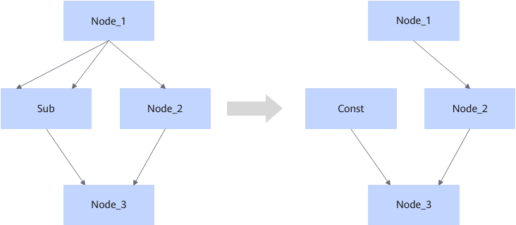

# SubFusionPass

## 融合模式

该融合将符合图融合pattern的Sub算子，在满足以下约束的情况下，融合成Const节点，修改Const节点的value是全0，shape与Sub节点的输出shape一致。

## 使用约束

- 当Sub的两个输入不是来自同一节点的同一输出时，该融合规则不生效。
- 当Sub的输入是动态shape时，该融合规则不生效。
- 当Sub的数据类型不在（float16/float32/uint8/int8/uint16/int16/int32/int64/double/complex64/complex128）范围内时，该融合规则不生效。

## 支持的型号

<!-- npu="910b" id1 -->
Atlas A2 训练系列产品/Atlas A2 推理系列产品
<!-- end id1 -->
