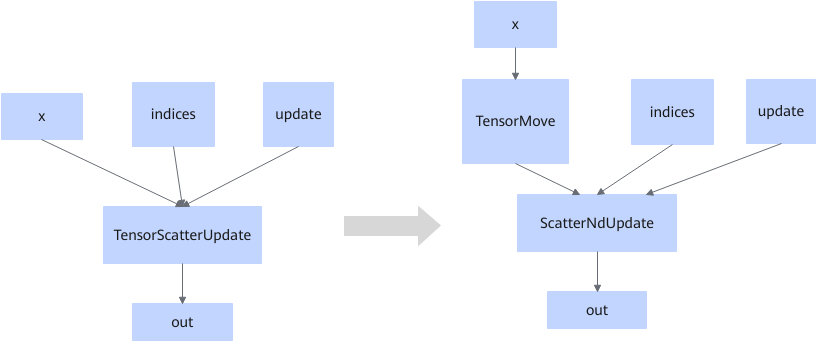

# TensorScatterUpdateFusionPass

## 融合模式

该融合将符合图融合pattern的TensorScatterUpdate算子，在输入输出数据类型不是Bool或int32时，修改为TensorMove+ScatterNdUpdate算子。

## 使用约束

- X的输入类型是Bool或者int32类型时，该融合规则不生效。
- 该融合规则不可关闭。

<!-- npu="950" id3 -->
Ascend 950PR/Ascend 950DT场景下，还存在如下使用约束。

- 由于ScatterNdUpdate算子aicore实现支持的数据类型为：int64、int8、float32、float16、bfloat16和bool。因此融合成功后，只有这六种数据类型执行aicore，其他类型执行aicpu。
- String和complex128类型在tensormove/ScatterNdUpdate上不支持时，该融合规则不生效。

<!-- end id3 -->
## 支持的型号

<!-- npu="910b" id1 -->
Atlas A2 训练系列产品/Atlas A2 推理系列产品
<!-- end id1 -->

<!-- npu="950" id2 -->
Ascend 950PR/Ascend 950DT
<!-- end id2 -->