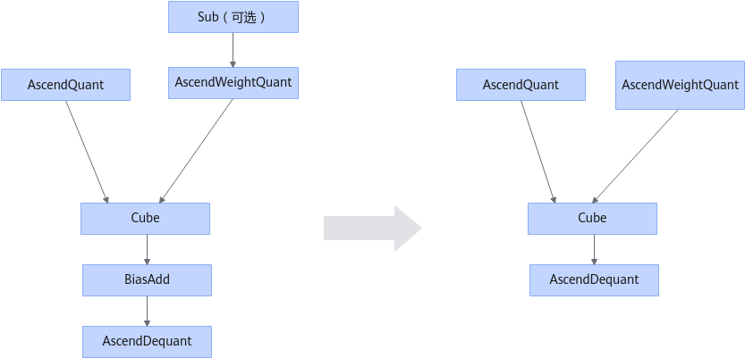
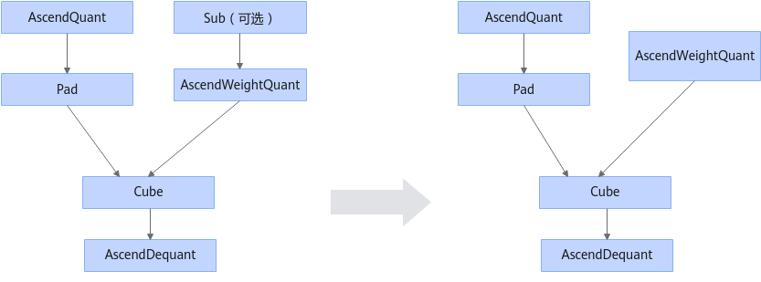
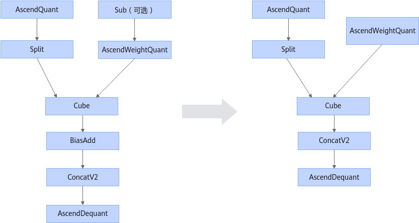
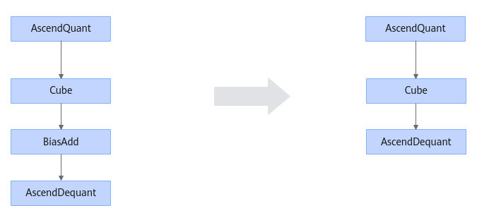

# TfMergeWeightQuantFusionPass

## 融合模式

量化场景，在下列图结构中，对于匹配到的Cube类算子（包括Conv2D/DepthwiseConv2D/Conv3D/Deconvolution/Conv2DTransposeD/MatMulV2/BatchMatMulV2），做如下图中处理。

如果AscendWeightQuant存在输入节点是sub时，则将Sub融合。

如果AscendWeightQuant不存在输入节点是sub时，更新AscendWeightQuant的format为HWCN格式。

如果Cube类算子后面连接BiasAdd节点，则将BiasAdd融合。

融合模式一：

融合模式二：

融合模式三：

融合模式四：

融合模式五：

融合模式六：

## 使用约束

融合条件存在AscendWeightQuant算子时，AscendWeightQuant算子需要至少两个输入。

split的输出需要和concat的输入数量需要一致，同时split的输出需要接concat的输入。

## 支持的型号

<!-- npu="950" id1 -->
Ascend 950PR/Ascend 950DT
<!-- end id1 -->
