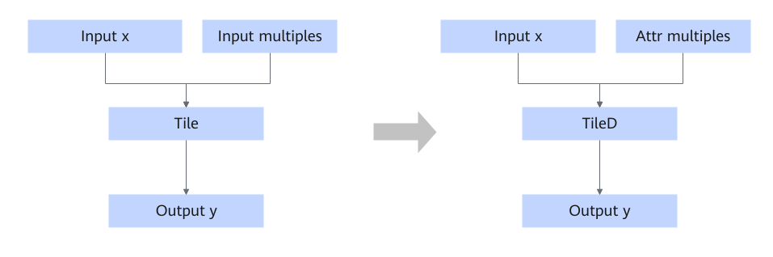

# TileConstToAttrFusion

## 融合模式

该融合规则将Tile转换成TileD，其中该融合规则的输入multiples将转换为required\_attr。

## 使用约束

- 输入multiples的数据类型仅支持int32和int64。
- 只支持input x的维度或multiples中元素个数大于5的场景。

## 支持的型号

<!-- npu="910b" id1 -->
Atlas A2 训练系列产品/Atlas A2 推理系列产品
<!-- end id1 -->

<!-- npu="A3" id2 -->
Atlas A3 训练系列产品/Atlas A3 推理系列产品
<!-- end id2 -->

<!-- npu="310p" id3 -->
Atlas 推理系列产品
<!-- end id3 -->

<!-- npu="310b" id4 -->
Atlas 200I/500 A2 推理产品
<!-- end id4 -->
