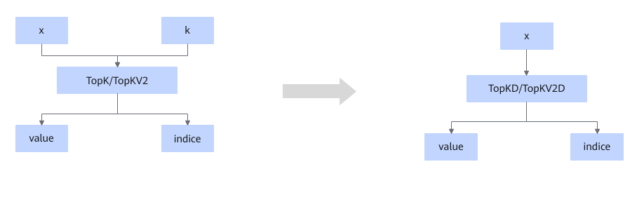
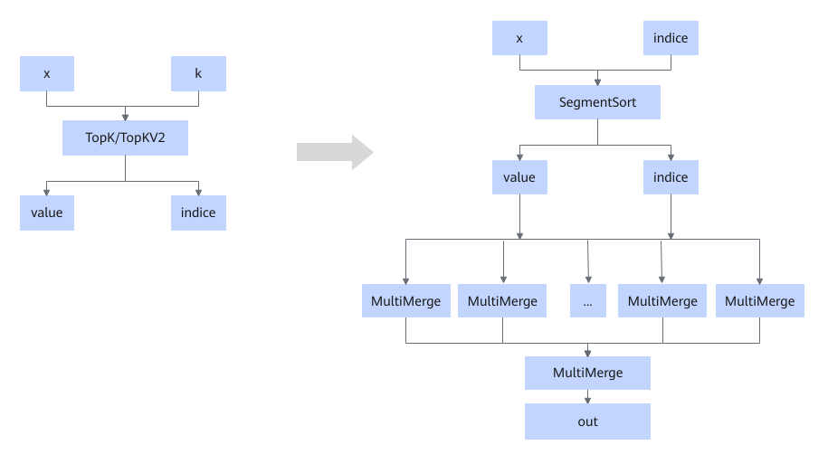

# TopKFusionPass

## 融合模式

该融合规则将TopK或TopKV2节点，基于平台的不同替换为TopKV2/TopKD/TopKV2D算子，或直接拆解为SegmentSort+MultiMerge的组合。详细场景如下。

场景一：TopK/TopKV2算子将被替换为TopKV2算子

场景二：TopK/TopKV2算子被替换为TopKD/TopKV2D算子

场景三：TopK/TopKV2算子将被拆分为SegmentSort+MultiMerge的组合

## 使用约束

  <!-- npu="A3,910b,910,310p,310b" id2 -->
- 如下形态，不支持TopK算子的attr.sorted=false；当输入k非const tensor时，TopK/TopKV2算子会替换为TopKV2算子；当输入k是const tensor时，TopK/TopKV2算子会替换为TopKD/TopKV2D算子。
  <!-- npu="A3" id3 -->
  - Atlas A3 训练系列产品/Atlas A3 推理系列产品
  <!-- end id3 -->
  <!-- npu="910b" id4 -->
  - Atlas A2 训练系列产品/Atlas A2 推理系列产品
  <!-- end id4 -->
  <!-- npu="310b" id5 -->
  - Atlas 200I/500 A2 推理产品
  <!-- end id5 -->
  <!-- npu="310p" id6 -->
  - Atlas 推理系列产品
  <!-- end id6 -->
  <!-- npu="910" id7 -->
  - Atlas 训练系列产品
  <!-- end id7 -->
  <!-- end id2 -->

<!-- npu="950" id1 -->
- Ascend 950PR/Ascend 950DT场景下，该融合规则不支持关闭。
- Ascend 950PR/Ascend 950DT场景下，TopK/TopKV2算子会替换为TopKV2算子。
<!-- end id1 -->

## 支持的型号

该Pass的有效性依赖于运行的产品是否支持相应算子类型TopK/TopKV2，具体信息请参考《算子库》中的“[Ascend IR算子规格说明](https://www.hiascend.com/document/detail/zh/CANNCommunityEdition/latest/API/aolapi/operatorlist_00094.html)”章节。
