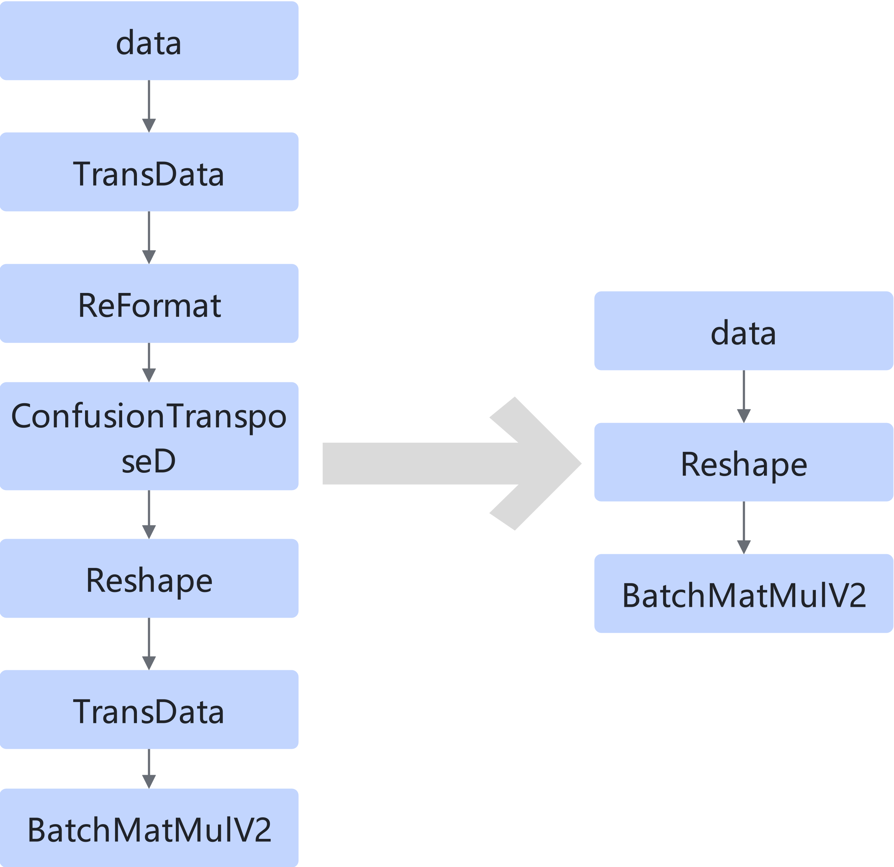

# TransdataTransposeTransdataBatchMatMulv2FusionPass

## 融合模式

将双BatchMatMulV2节点间的TransData、Transpose等冗余节点删除。

模式一：

模式二：

模式三：

## 使用约束

第一个TransData的输出数据类型要求是float16。

所有节点都只能单引用。

Transpose的perm列表只能是\[0,2,1,3\],且最后一维要能被16整除。

第一个TransData的输入与第二个TransData的输出的Shape最后3维要完全一致。

## 支持的型号

<!-- npu="310p" id1 -->
Atlas 推理系列产品
<!-- end id1 -->
