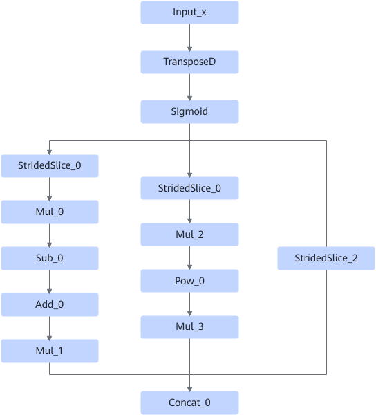
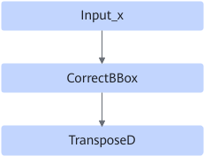
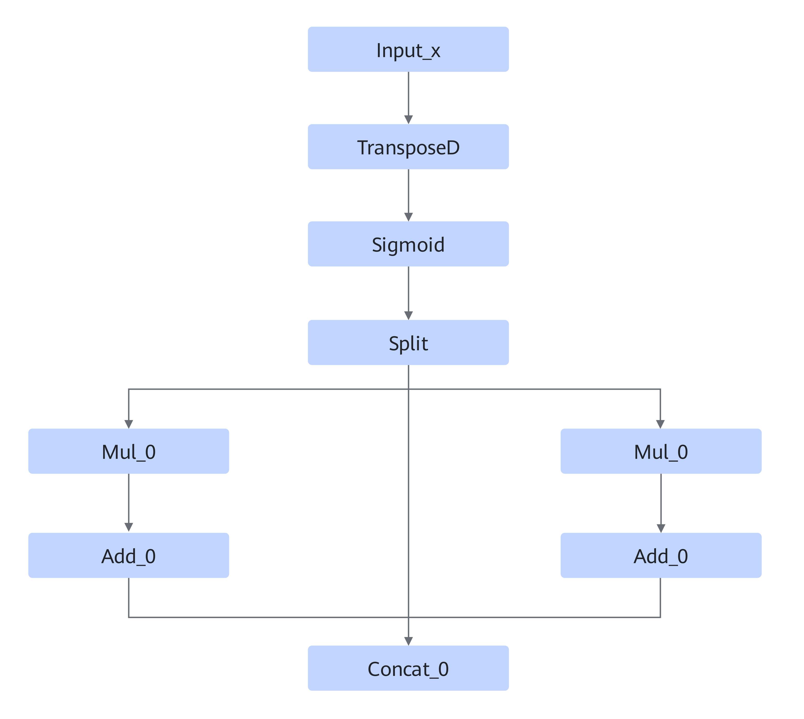

# TransposeSigmoidMulAddPowConcatFusionPass

## 融合模式

该融合规则将yolov3，yolov5和yolov7不带nms后处理算子的模型最后的sigmoid结构融合成一个算子。

**模式一：**

融合成

**模式二：**

融合成

## 使用约束

无

## 支持的型号

<!-- npu="310p" id1 -->
Atlas 推理系列产品
<!-- end id1 -->
