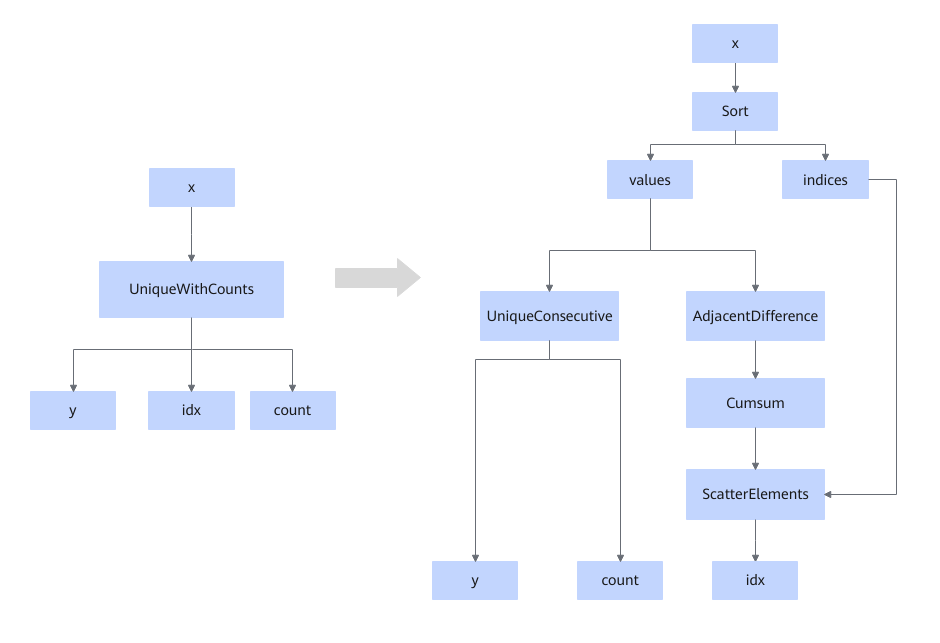

# UniqueSortFusionPass

## 融合模式

将Unique或UniqueWithCount算子拆分为Sort+AdjacentDifference+Cumsum+Scatter+UniqueConsecutive算子的组合以完成计算。

拆分前的Unique/UniqueWithCount算子为aicpu算子，拆分后的Sort、AdjacentDifference、Cumsum、Scatter和UniqueConsecutive五个算子均为aicore算子。

场景一：

场景二：

## 使用约束

- 输出idx和count数据类型是int32、int64。
- 输入x的数据类型是int64、int32、int16、int8、uint64、uint32、uint16、uint8、bfloat16、float16、float32。
<!-- npu="950" id2 -->
- Ascend 950PR/Ascend 950DT场景下，该融合规则不支持关闭。
<!-- end id2 -->

## 支持的型号

<!-- npu="950" id1 -->
Ascend 950PR/Ascend 950DT
<!-- end id1 -->
