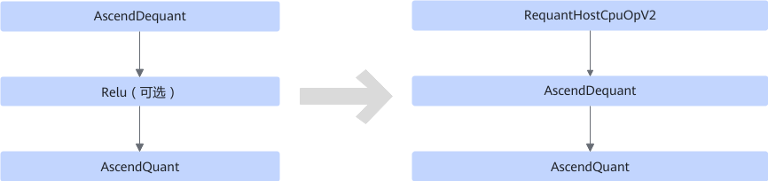

# V100RequantFusionPass

## 融合说明

该融合在推理场景下对量化节点进行优化。

匹配如下结构，在AscendDequant的输入插入RequantHostCpuOpV2算子。

- **场景一**

  

- **场景二**

  

- **场景三**

  

## 使用约束

如果有多个AscendDequant，则每个AscendDequant对应的scale值必须一致。

## 支持的型号

<!-- npu="310p" id1 -->
Atlas 推理系列产品
<!-- end id1 -->
