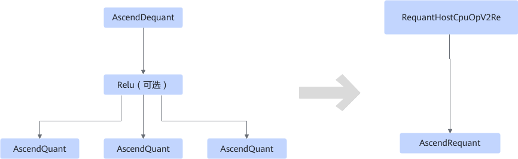
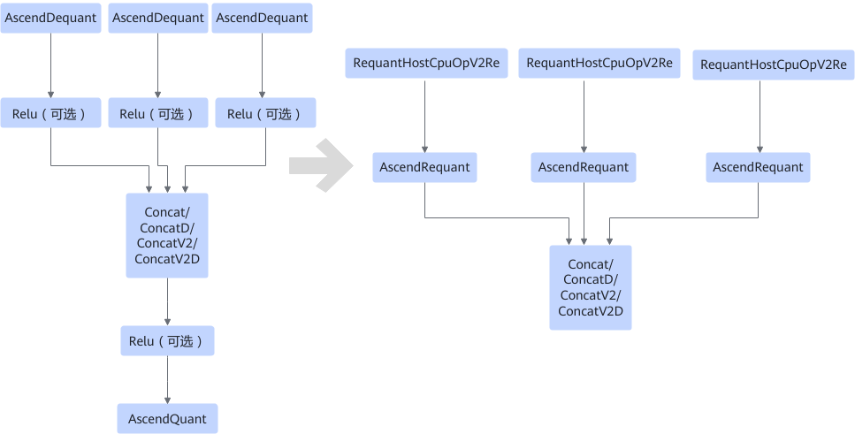

# V200RequantFusionPass

## 融合说明

该融合在推理场景下对量化节点进行优化。

匹配如下结构，将AscendDequant和AscendQuant融合为AscendRequant，在AscendDequant的输入插入RequantHostCpuOpV2Re算子。

- **场景一**

  

- **场景二**

  

- **场景三**

  

- **场景四**

  

## 使用约束

该融合pass主要用于推理网络量化模型时，对反量化算子融合处理。

模型小型化工具对原始框架模型进行量化时，会插入量化和反量化算子，但使用ATC工具进行模型转换过程中，会对插入的量化和反量化算子进行融合，此情况下就无法进行量化后模型dump结果与原始模型dump结果的比对，因此如果用户想使用通过模型小型化工具量化后的模型进行精度比对，则必须关闭该融合规则，详细操作请参见[如何关闭/开启融合规则](../Introduction.md)。

另外，还有如下约束。

- 如果有多个AscendQuant，则每个AscendQuant对应的scale值必须一致。
- Concat/ConcatD/ConcatV2/ConcatV2D的dim轴必须是C轴，C轴与dtype对齐。
  - 原始dtype为fp16和float时，dim C需要为16的倍数。
  - 原始dtype为int8，dim C需要为32的倍数。
  - 原始dtype为int4，dim C需要为64的倍数。

## 支持的型号

<!-- npu="310p" id1 -->
Atlas 推理系列产品
<!-- end id1 -->
