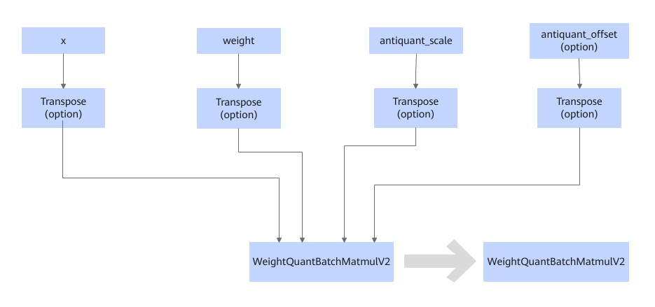

# WeightQuantBatchMatmulV2TransposeFusionPass

## 融合模式

对于WeightQuantBatchMatmulV2所连接的Transpose节点，将其信息下沉到transpose\_x和transpose\_weight属性中。

## 使用约束

- 当weight节点连接Transpose节点时，才处理antiquant\_scale和antiquant\_offset所连接的Transpose节点。
- 该融合规则不可关闭，关闭后会触发功能问题。

## 支持的型号

<!-- npu="910b" id1 -->
Atlas A2 训练系列产品/Atlas A2 推理系列产品
<!-- end id1 -->

<!-- npu="A3" id2 -->
Atlas A3 训练系列产品/Atlas A3 推理系列产品
<!-- end id2 -->

<!-- npu="950" id3 -->
Ascend 950PR/Ascend 950DT
<!-- end id3 -->
